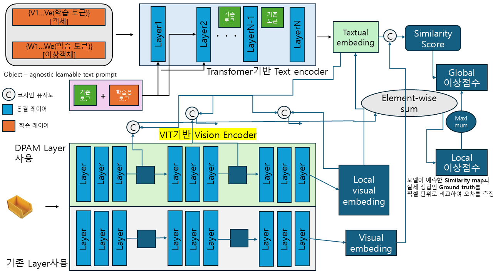
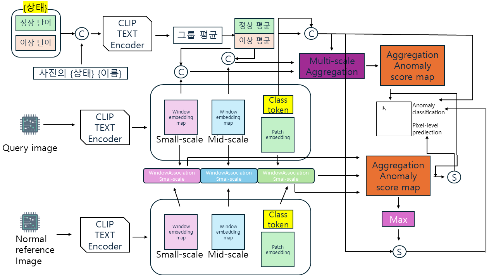

# 2026-W37 미팅 Brief - AnomalyCLIP VisA→MVTec AD 재현

## 0. 지난주 피드백 반영과 이번 주 변화

### 지난주 상태

- W36에서 AnomalyCLIP은 source domain으로 prompt를 학습하고 target domain에는 학습·정상 reference 없이 적용하는 방법으로 정리함 [1].
- 그러나 실제 공개 구현체가 그 protocol을 실행하는지와 MVTec AD 결과는 확인하지 못했음.

### 피드백 반영

| 지난주 피드백 | 처리 상태 | 근거 경로 | 메모 |
|---|---|---|---|
| source domain과 target domain을 구분할 것 | 완료 | `method6/source/run_anomalyclip_visa_to_mvtec_wsl.sh` | VisA를 학습 source, MVTec AD를 평가 target으로 고정함. |
| target data 사용 방식을 확인할 것 | 완료 | `method6/source/run_anomalyclip_visa_to_mvtec_wsl.sh`, `method6/source/results/anomalyclip_visa_to_mvtec/results.csv` | MVTec AD는 prompt 학습이나 normal reference에 넣지 않고 평가에만 사용함. |

### 이번 주 변화

- 공식 AnomalyCLIP revision `3911738c0867544f545a076ad78f3f11d9ecbfdf`를 WSL에서 실행함.
- 논문 및 공식 `train.sh`의 VisA 학습 설정으로 prompt를 15 epoch 학습하고, 마지막 checkpoint로 MVTec AD 15개 범주를 평가함.
- 평균 Pixel AUROC 91.0%, Pixel AUPRO 81.6%, Image AUROC 91.6%, Image AP 96.2%를 얻음.
- bottle, pill, transistor의 target anomaly map 예시를 별도 저장함.
- WinCLIP을 MVTec AD에서 zero-shot과 WinCLIP+ 1/2/4 normal-shot으로 실행함 [2].

### 현재 연구 단계

- 현재 phase: Phase 2 - Evidence Reproduction.
- 이 phase라고 판단한 이유: 공개 방법의 code, 실행 script, raw result CSV, 예측지도까지 연결했지만 논문 수치와의 strict 비교 또는 새 방법의 한계 분석은 아직 수행하지 않았음.
- 다음 phase로 가기 위해 필요한 evidence: 논문 표의 동일 protocol 수치와의 항목별 비교, source dataset을 바꾼 재실행 또는 낮은 범주의 failure 원인 분석.

### Evidence Map

| 판단 / claim / 질문 | 짧은 요약 | 근거 경로 | Raw data / Plot | 이 근거가 결정하는 것 |
|---|---|---|---|---|
| VisA→MVTec AD protocol이 실행됨 | VisA로 prompt를 학습하고 MVTec AD 15개 범주만 평가함 | `method6/source/run_anomalyclip_visa_to_mvtec_wsl.sh` | `method6/source/results/anomalyclip_visa_to_mvtec/results.csv` | target zero-shot 실행 여부 |
| target에서 image·pixel 점수를 모두 산출함 | 15개 범주 평균 Image AUROC 91.6%, Pixel AUROC 91.0% | `method6/source/collect_anomalyclip_results.py` | `method6/source/results/anomalyclip_visa_to_mvtec/results.csv` | 재현 결과의 수치 근거 |
| 위치 예측은 시각적으로 확인 가능함 | 세 불량 사례에 input, heatmap, overlay를 저장함 | `method6/source/visualize_anomalyclip_examples.py` | `method6/source/results/anomalyclip_visa_to_mvtec/visualizations/` | anomaly map의 확인 가능성 |
| WinCLIP의 target normal reference 효과 | 0-shot 대비 1/2/4-shot에서 MVTec AD 평균 Pixel·Image AUROC가 상승함 | `method7/source/run_winclip_mvtec_wsl.sh` | `method7/source/results/winclip_mvtec/*/results.csv` | target normal reference를 쓰는 WinCLIP+ 조건의 변화 |

## 1. 서론

### 1.1 연구 배경과 중요성

- Vision anomaly detection은 제품 이미지에서 불량 여부와 불량 위치를 찾는 문제임.
- 새 제품 target에 대한 이상 label을 모으기 어렵기 때문에, target data를 학습하지 않고 적용하는 zero-shot 설정이 중요함.
- AnomalyCLIP은 CLIP의 text prompt를 source anomaly data로 학습해 target에 적용하는 접근임 [1].

### 1.2 기존 접근의 큰 계열과 한계

- target full-shot 학습: target의 정상·이상 데이터를 직접 사용하므로 target 성능을 높일 수 있으나, 새 제품마다 label과 학습 비용이 필요함.
- pretrained CLIP zero-shot: target 학습 데이터가 필요 없으나, 일반적인 물체 의미 표현만으로 정상·이상 차이를 충분히 구분하기 어려울 수 있음 [1].

### 1.3 우리가 집중하는 접근과 남은 문제

- 집중 접근: source domain으로 object-agnostic normal/abnormal prompt를 학습하고 unseen target에 적용하는 AnomalyCLIP [1].
- 장점: target MVTec AD의 train image나 normal reference 없이 image-level score와 pixel-level map을 함께 출력함.
- 남은 문제: source에서 학습한 prompt가 모든 target 범주에 같은 수준으로 일반화하는지는 이 한 번의 평균만으로 판단할 수 없음.

### 1.4 원인 가설

- 관찰한 limitation: cable의 Image AUROC는 69.5%, transistor의 Pixel AUROC는 70.5%로 평균보다 낮음.
- H1: source에서 배운 normal/abnormal prompt가 target 범주의 미세한 구조와 결함 형태를 동일하게 표현하지 못하면 범주별 성능 차이가 커질 수 있음.
- H1이 맞다면: 범주별 결과와 anomaly map에서 낮은 범주의 오검출 또는 위치 불일치가 더 자주 관찰되어야 함.

### 1.5 이번 주 선택한 방향

- 공개 구현체의 VisA→MVTec AD protocol을 먼저 재현함.
- 이유: H1을 분석하기 전에 source/target 분리, score 산출, raw result가 실제로 연결되는 기준 실행이 필요함.

### 1.6 이번 주 기여 또는 검토 초점

- 핵심 판단: AnomalyCLIP의 VisA 학습 prompt를 사용해 MVTec AD target 전체에서 image·pixel 지표와 anomaly map을 산출하는 공개 protocol을 실행함.
- evidence: `method6/source/results/anomalyclip_visa_to_mvtec/results.csv`.

## 2. 사전 지식과 문제 정의

### 배경

- CLIP: 이미지와 문장을 같은 표현 공간으로 옮겨 유사도를 계산하는 사전학습 모델임.
- AnomalyCLIP: CLIP backbone은 고정하고 normal/abnormal을 나타내는 learnable text prompt를 source data로 학습하는 방법임 [1].

### 기술 용어

- *source domain* [1]: prompt 학습에 쓰는 보조 데이터셋. 이번 실행에서는 VisA임.
- *target domain* [1]: 학습한 prompt를 적용해 성능을 측정하는 데이터셋. 이번 실행에서는 MVTec AD임.
- *Image AUROC* [1]: 정상·이상 이미지의 점수 순위가 얼마나 잘 분리되는지 측정하는 값. 100%에 가까울수록 좋음.
- *Pixel AUROC* [1]: 각 위치의 anomaly map이 정답 결함 위치와 얼마나 잘 분리되는지 측정하는 값. 100%에 가까울수록 좋음.
- *Pixel AUPRO* [1]: 결함 영역을 연결된 영역 단위로 얼마나 잘 찾는지 측정하는 값. 100%에 가까울수록 좋음.

### 표기법

| 표기법 | 설명 |
|---|---|
| `D_s` | source dataset VisA |
| `D_t` | target dataset MVTec AD |
| `p_n`, `p_a` | 학습하는 normal / abnormal text prompt |
| `s_I`, `s_P` | image-level / pixel-level anomaly score |

### 정의

정의 1. target zero-shot 실행.
`D_s`로 `p_n`, `p_a`를 학습한 뒤, `D_t`의 train image·normal reference를 학습 또는 비교 기준에 사용하지 않고 `D_t` test image의 `s_I`, `s_P`를 계산하는 실행임.

### 문제 정의

문제 1. VisA→MVTec AD zero-shot anomaly detection.
VisA `D_s`와 MVTec AD test image `D_t`가 주어졌을 때, target 학습·reference 없이 각 target 이미지의 이상 점수 `s_I`와 각 위치의 anomaly map `s_P`를 출력한다. 성공 기준은 MVTec AD의 Image AUROC, Pixel AUROC, Pixel AUPRO로 확인함.

## 3. 관련 연구

### 3.1 현재 문제를 푸는 큰 연구 흐름

- CLIP 기반 target zero-shot anomaly detection:
  - 문제: target 범주의 학습 데이터를 쓰지 않고 이상 이미지와 위치를 찾음.
  - 대표 논문: AnomalyCLIP [1].
  - 한계: source supervision의 종류에 따라 target 일반화가 달라질 수 있음.

### 3.2 현재 원인 가설에 대응하는 관련 연구

- AnomalyCLIP [1]: object-agnostic prompt와 global-local loss로 물체 이름보다 정상·이상 공통 신호를 prompt에 넣으려 함.
- H1과의 연결: target 범주별 성능 편차가 남아 있다면 object-agnostic prompt만으로 모든 구조적 결함을 같은 수준으로 표현하지 못한 가능성을 검토할 수 있음. 현재는 가설이며 원인으로 확정하지 않음.

*그림 1. 사용자 제작 AnomalyCLIP 설계도. 학습 가능한 normal/abnormal text prompt, 고정 CLIP text·vision encoder, local/global visual feature, cosine similarity 기반 anomaly score의 흐름을 정리함. 학습에서는 prompt를 갱신하고, target 추론에서는 global score와 local anomaly map을 산출함.*

### 3.3 WinCLIP 설정 참고

WinCLIP은 CLIP의 text prompt와 multi-scale window feature를 이용해 image-level anomaly classification과 pixel-level prediction을 함께 수행함 [2]. zero-shot WinCLIP은 target normal reference를 사용하지 않으며, WinCLIP+는 target 정상 reference image와 query image의 window feature를 비교함 [2]. 아래 구조도는 이 두 흐름과 score aggregation을 사용자 제작으로 정리한 것임.

*그림 2. 사용자 제작 WinCLIP 구조도. 위쪽은 normal/abnormal text prompt와 query image의 유사도 흐름, 아래쪽은 WinCLIP+에서 target normal reference와 query image의 multi-scale window feature를 비교하는 흐름을 나타냄. `S`는 score 계산, `C`는 cosine similarity를 뜻함.*

### 3.4 이번 주 해결 후보 요약

- 후보 A: 공식 VisA→MVTec AD protocol 재현.
  - 관련 연구 근거: AnomalyCLIP의 cross-dataset evaluation [1].
  - 이번 주 판단: 선택. 이후 범주별 failure 분석의 기준 결과가 됨.
- 후보 B: target MVTec AD로 full-shot 재학습.
  - 이번 주 판단: 제외. target zero-shot 조건을 깨므로 이번 질문의 검증에는 맞지 않음.

## 4. 선택한 방법 또는 절차

- 선택한 후보: 공식 AnomalyCLIP의 VisA→MVTec AD 실행.
- 실행 revision: `3911738c0867544f545a076ad78f3f11d9ecbfdf`.
- 학습: CLIP `ViT-L/14@336px`, VisA, image size 518, batch size 8, 15 epoch, feature layer 24, prompt depth 9, `n_ctx=12`, `t_n_ctx=4`, seed 111.
- 평가: MVTec AD 15개 범주, image size 518, feature layer 24, Gaussian smoothing `sigma=4`, image-pixel-level metrics.
- 구현 변경: Windows의 대소문자 충돌을 피하기 위해 upstream clone은 WSL ext4에 두었고, CLIP cache 경로와 VisA metadata 생성만 호환용으로 보조함. 모델·데이터·checkpoint는 repository에 올리지 않음.
- runtime 주의: 논문은 PyTorch 2 및 RTX 3090을 사용했다고 명시함 [1]. 이번 실행은 PyTorch 2.11 / CUDA 12.8 / RTX 5080이므로 논문·공식 코드의 data/model/hyperparameter protocol을 맞춘 실행이지 bitwise 동일 재현은 아님.

## 5. 실험

### 비교 기준

- 비교 기준: AnomalyCLIP 공식 VisA source → MVTec AD target protocol [1].

### 평가 지표

- Image AUROC, Image AP, Pixel AUROC, Pixel AUPRO. 모든 값은 %이며 높을수록 좋음.

### 데이터셋

- source: VisA.
- target: MVTec AD test split 1,725 images, 15 product/texture categories.
- target data 사용: 학습과 normal reference에 사용하지 않고 평가에만 사용함.

### 실험 1: VisA→MVTec AD prompt transfer

#### 질문

- VisA로 학습한 prompt가 MVTec AD target에서 image-level과 pixel-level anomaly score를 모두 낼 수 있는가?

#### 가설

- H1: 공식 protocol이 정상 실행되면 모든 MVTec AD 범주의 image·pixel metric과 anomaly map이 산출됨.

#### 설정

- Dataset: VisA → MVTec AD.
- Method: AnomalyCLIP [1], epoch 15 checkpoint.
- Metric: Image AUROC / Image AP / Pixel AUROC / Pixel AUPRO.
- 근거 경로:
  - code: `method6/source/run_anomalyclip_visa_to_mvtec_wsl.sh`
  - compatibility: `method6/source/anomalyclip_wsl_compat.patch`, `method6/source/generate_anomalyclip_metadata.py`
  - result: `method6/source/results/anomalyclip_visa_to_mvtec/results.csv`

#### 기대 결과

- 15개 범주의 네 지표와 평균이 raw CSV에 저장되고, target anomaly map 예시가 생성됨.

#### 실제 결과

| 지표 | 기대 | 실제 | 해석 | Raw Path |
|---|---|---:|---|---|
| Image AUROC (%) | 15개 범주와 평균 산출 | 91.6 | target 이미지의 정상·이상 순위를 산출함 | `method6/source/results/anomalyclip_visa_to_mvtec/results.csv` |
| Image AP (%) | 15개 범주와 평균 산출 | 96.2 | image-level score를 평균 정밀도로도 확인함 | `method6/source/results/anomalyclip_visa_to_mvtec/results.csv` |
| Pixel AUROC (%) | 위치 점수 산출 | 91.0 | pixel-level anomaly map을 정량 평가함 | `method6/source/results/anomalyclip_visa_to_mvtec/results.csv` |
| Pixel AUPRO (%) | 영역 단위 위치 성능 산출 | 81.6 | 결함 영역 회복 성능을 별도 지표로 확인함 | `method6/source/results/anomalyclip_visa_to_mvtec/results.csv` |

#### 해석

- H1은 실행 가능성 수준에서 지지됨. 모든 범주의 image·pixel 결과가 산출됐음.
- 평균 수치만으로 source prompt transfer가 논문과 동일하거나 다른 방법보다 우수하다고 주장할 수는 없음. 동일 runtime의 논문 표 비교와 반복 실행이 아직 없음.

### 실험 2: target anomaly map 예시

#### 질문

- 정량 지표 외에 target 불량 위치를 시각적으로 확인할 수 있는가?

#### 가설

- 동일 checkpoint와 anomaly-map 식을 사용하면 정상·이상 위치의 상대적 점수가 heatmap으로 저장됨.

#### 설정

- 대상: `bottle/broken_large`, `pill/color`, `transistor/bent_lead`의 불량 test image 각 1장.
- code: `method6/source/visualize_anomalyclip_examples.py`
- raw outputs: `method6/source/results/anomalyclip_visa_to_mvtec/visualizations/`.

#### 기대 결과

- 각 사례의 input, heatmap, overlay가 저장됨.

#### 실제 결과

| 지표 | 기대 | 실제 | 해석 | Raw Path |
|---|---|---|---|---|
| 저장 파일 | 사례별 3개 파일 | 3 사례 × input/heatmap/overlay | 빨강·노랑은 상대적으로 높은 anomaly score 위치 | `method6/source/results/anomalyclip_visa_to_mvtec/visualizations/` |

#### 해석

- 이 이미지는 정답 비교 지표가 아니라 모델 score의 공간 분포를 보여주는 보조 evidence임. 결함을 정확히 찾았는지는 Pixel AUROC/AUPRO 및 ground-truth mask와 함께 판단해야 함.

### 실험 3: WinCLIP zero-shot과 WinCLIP+ few-normal-shot

#### 질문

- 같은 MVTec AD target에서 normal reference를 추가하면 WinCLIP의 image·pixel 성능이 어떻게 달라지는가?

#### 가설

- H2: target의 정상 image를 reference로 쓰는 WinCLIP+는 zero-shot WinCLIP보다 높은 평균 AUROC를 낼 수 있음 [2].

#### 설정

- Dataset: MVTec AD 15개 범주.
- Model: LAION-400M CLIP `ViT-B/16+`, 240px, compositional prompt ensemble, window stride 1 [2].
- Conditions: WinCLIP 0-shot; WinCLIP+ 1/2/4 normal-shot. seed 10.
- code: `method7/source/run_winclip_mvtec_wsl.sh`.
- implementation note: 원 저자의 공식 code release는 확인하지 못했음. 논문 조건과 image/pixel 평가를 제공하는 공개 재현 구현체 `zqhang/Accurate-WinCLIP-pytorch` revision `eef4f8cce6a80eddfa07415b503c22c6c3427351`를 사용함.

#### 기대 결과

- 0-shot과 1/2/4-shot 각각에서 범주별 및 평균 metric이 CSV로 저장됨.

#### 실제 결과

| Condition | Target normal reference | Pixel AUROC (%) | AUPRO (%) | Image AUROC (%) | Raw Path |
|---|---:|---:|---:|---:|---|
| WinCLIP 0-shot | 0장 | 82.3 | 61.9 | 90.4 | `method7/source/results/winclip_mvtec/zero_shot/results.csv` |
| WinCLIP+ 1-shot | 범주별 1장 | 93.6 | 84.1 | 93.7 | `method7/source/results/winclip_mvtec/one_shot/results.csv` |
| WinCLIP+ 2-shot | 범주별 2장 | 93.8 | 84.8 | 93.7 | `method7/source/results/winclip_mvtec/two_shot/results.csv` |
| WinCLIP+ 4-shot | 범주별 4장 | 94.2 | 85.4 | 95.3 | `method7/source/results/winclip_mvtec/four_shot/results.csv` |

#### 해석

- H2는 이 재현 구현체의 결과에서 지지됨. 0-shot 대비 1-shot에서 Pixel AUROC는 11.3%p, Image AUROC는 3.3%p 높음.
- 다만 WinCLIP+는 target normal reference를 사용하므로 target zero-shot인 AnomalyCLIP의 91.0% Pixel AUROC와 같은 정보 조건의 직접 비교가 아님.

## 6. 논의

- 지금 주장할 수 있는 것: 공개 AnomalyCLIP의 VisA→MVTec AD zero-shot protocol을 실제로 실행했고, target 전체의 raw metric과 대표 anomaly map을 남김.
- 아직 주장할 수 없는 것: 논문 수치와 strict 동일 재현, source prompt transfer의 원인 설명, 다른 zero-shot 방법보다 우수하다는 결론.
- H1에 대해 알려준 것: 범주별 편차가 존재함. cable Image AUROC 69.5%, transistor Pixel AUROC 70.5%는 후속 failure analysis의 우선 대상임.
- 남은 불확실성: GPU·PyTorch 버전이 논문 환경과 달라 수치 차이가 있다면 원인을 분리할 수 없음. 단일 seed라 변동성도 확인하지 못함.
- 다음 검증: 논문 표의 동일 VisA→MVTec AD row를 원문에서 추출해 지표별 차이를 기록하고, cable·transistor의 target map과 정답 mask를 여러 장 비교함.

## 7. 참고문헌

[1] Zhou, Qihang, Guansong Pang, Yu Tian, Shibo He, and Jiming Chen. "AnomalyCLIP: Object-agnostic Prompt Learning for Zero-shot Anomaly Detection." *The Twelfth International Conference on Learning Representations*, 2024.

[2] Jeong, Jongheon, et al. "WinCLIP: Zero-/Few-Shot Anomaly Classification and Segmentation." *Proceedings of the IEEE/CVF Conference on Computer Vision and Pattern Recognition*, 2023, pp. 19606-19616.

## 8. 이번 주 주요 질문 1개

- 질문: cable과 transistor의 낮은 지표를 source prompt의 일반화 한계로 분석하기 전에, 어떤 비교 evidence를 먼저 추가해야 하는가?
- 내가 현재 판단한 답: 논문과 동일한 VisA→MVTec AD row의 지표 차이를 먼저 비교하고, 낮은 두 범주의 여러 anomaly map과 ground-truth mask를 함께 확인해야 함.
- 그 판단의 근거: 현재 결과는 단일 runtime·단일 seed의 평균이며, 낮은 점수가 구현 환경 차이인지 구조적 failure인지 구분되지 않음.
- 왜 이 판단이 틀렸을 수 있는가: 단일 범주 시각화보다 source dataset을 바꾼 ablation이 더 직접적인 evidence일 수 있음.
- 교수님이 판단해주면 다음 주 무엇이 바뀌는가: failure analysis를 우선할지, source-domain ablation을 우선할지 결정함.
