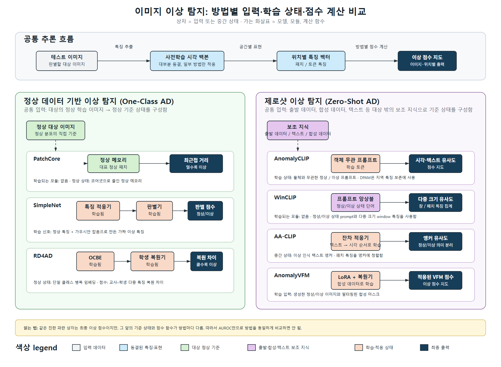

# 2026-W39 미팅 Brief - Target 정렬 관점의 이상 탐지 방법 한계 분석

## 0. 지난주 피드백 반영과 이번 주 변화

### 지난주 상태

- W38에서 PatchCore, SimpleNet, RD4AD, AnomalyCLIP, WinCLIP, AA-CLIP, AnomalyVFM의 입력·중간 상태·점수 계산을 한 그림으로 정리함.
- 그러나 그림은 방법을 설명할 뿐, 어떤 공통 한계를 우선 검증해야 하는지와 그 근거는 정리하지 못함.

### 피드백 반영

| 지난주 피드백 | 처리 상태 | 근거 경로 | 메모 |
|---|---|---|---|
| AnomalyVFM을 포함해 각 방법의 입력 정보, 학습되는 모듈, 중간 상태와 점수 계산의 차이가 상자와 화살표 자체에서 보이도록 비교 그림을 계속 교정할 것 | 완료 | [비교 그림](images/2026-W39_ad_method_comparison_ko.png) | 상자=입력·중간 상태·출력, 가는 화살표=특징 추출·학습·점수 함수로 고정함. WinCLIP+는 pure zero-shot 비교에서 제외함. |
| 공통 한계, 원인 가설, 이를 겨냥한 개선 방향과 검증 순서를 연결할 것 | 부분 | `## 1`, `## 3`, `## 5`, `## 6` | 공통 한계 H1과 진단 evidence를 정리함. H1을 직접 개선한 최신 논문 조사와 새 통제 실험은 다음 단계임. |

### 이번 주 변화

- 7개 방법을 `기준 상태를 만드는 입력 → 중간 상태 → 점수 함수`로 통일해 비교함.
- target 정상 정보를 직접 쓰는 One-Class AD와 target 밖의 text·source·synthetic 정보로 기준을 만드는 zero-shot AD를 구분함.
- 공통 한계 후보 중 **target에 정렬된 정상·이상 기준을 만들기 어려움**을 H1으로 우선 검증하기로 함.
- H1은 아직 인과관계로 증명되지 않았음. dataset 난이도와 protocol 차이도 결과 차이의 가능한 원인임.

### 현재 연구 단계

- 현재 phase: **Phase 3 - Limitation Identification (초기)**.
- 이 phase라고 판단한 이유: 기존 재현의 raw result와 방법 구조를 연결해 limitation 후보와 진단 질문을 정했음. 아직 H1을 바꾸는 새 모듈이나 ablation은 실행하지 않았음.
- 다음 phase로 가기 위해 필요한 evidence: target 정보 사용 여부만 달라지는 통제 비교, 정상 오탐·결함 누락 사례, H1과 유사한 문제를 개선한 prior work.

### Evidence Map

| 판단 / claim / 질문 | 짧은 요약 | 근거 경로 | Raw data / Plot | 이 근거가 결정하는 것 |
|---|---|---|---|---|
| 방법별 이상 기준은 서로 다름 | memory 거리, 판별기, teacher-student 차이, visual-text 유사도, decoder 점수로 이상을 계산함 | `## 2`, `## 3` | [비교 그림](images/2026-W39_ad_method_comparison_ko.png) | 방법을 같은 출력만으로 동일시하지 않음 |
| target 정상 정보의 사용 여부는 protocol을 바꿈 | WinCLIP 0-shot은 reference 없음, WinCLIP+는 target 정상 reference를 사용함 | `meetings/2026-W37_brief.md` | `method7/source/results/winclip_target_comparison.csv` | WinCLIP+를 pure zero-shot과 분리함 |
| 같은 zero-shot 조건도 target에 따라 성능 양상이 달라짐 | WinCLIP 0-shot의 MVTec AD/VisA Image AUROC는 90.4%/75.5%, Pixel AUROC는 82.3%/73.2%임 | `meetings/2026-W37_brief.md` | `method7/source/results/winclip_target_comparison.csv` | H1을 검증할 필요가 있는 관찰 |
| H1은 아직 원인으로 확정되지 않음 | MVTec AD와 VisA는 결함·범주·split이 다르고, WinCLIP+는 정보 조건도 다름 | `## 5`, `## 6` | 위 비교 CSV | 새 통제 실험 전에는 인과 주장하지 않음 |

## 1. 서론

### 1.1 연구 배경과 중요성

- 이 연구가 속한 영역은 **vision anomaly detection**임. 정상 제품 이미지에서 학습하거나 보조 지식을 이용해, 새 이미지의 불량 여부와 불량 위치를 찾는 문제임.
- 실제 검사에서는 결함 이미지가 드물고 결함 유형도 미리 다 알기 어렵기 때문에, 정상 데이터만 쓰는 One-Class AD와 target 결함 데이터를 보지 않는 zero-shot AD가 중요함 [1-7].
- 최근에는 normal memory·복원 차이 같은 One-Class AD뿐 아니라 CLIP text prompt와 VFM을 이용해 새 target에 바로 적용하려는 zero-shot 접근이 늘고 있음 [1-7].

### 1.2 기존 접근의 큰 계열과 한계

- **One-Class AD**: target 정상 이미지에서 정상 기준을 직접 만듦. PatchCore는 대표 정상 patch memory와 최근접 거리를 쓰고 [1], SimpleNet은 정상 특징과 가짜 이상 특징으로 판별기를 학습하며 [2], RD4AD는 teacher 특징과 학생 복원 특징의 차이를 사용함 [3].
  - 유용한 이유: target 제품의 실제 정상 모양·질감을 기준에 직접 반영함.
  - 한계: 새 target마다 정상 이미지를 확보하고 memory·판별기·복원기를 구성해야 함.
- **Zero-shot AD**: target 정상 학습 이미지를 쓰지 않고 기준을 만듦. AnomalyCLIP·AA-CLIP은 source 데이터로 적응한 text anchor를 [4, 6], WinCLIP은 CLIP prompt ensemble을 [5], AnomalyVFM은 synthetic normal/anomaly data로 적응한 VFM을 사용함 [7].
  - 유용한 이유: target 학습 데이터가 없거나 적은 상황에 적용할 수 있음.
  - 한계: text·source·synthetic 기준이 target의 실제 정상 변형과 결함 의미에 맞는지 보장되지 않음.

### 1.3 우리가 집중하는 접근과 남은 문제

- 이번 주에는 한 방법을 새로 제안하지 않고, One-Class AD와 zero-shot AD가 **정상·이상 판단 기준을 만드는 방식**에서 어떻게 다른지 분석함.
- 비교 그림은 방법별 입력, 학습 모듈, 중간 상태, 점수 계산을 같은 표현으로 고정함.
- 남은 challenge: target을 직접 보지 않는 zero-shot 기준이 target의 정상 변형·결함 의미와 어긋나는지, 혹은 단순히 dataset 난이도 차이인지 분리하지 못함.
- 이 challenge의 현재 evidence: WinCLIP 0-shot은 MVTec AD와 VisA에서 서로 다른 평균을 보였고, target normal reference를 추가한 WinCLIP+는 별도 protocol에서 상승함 (`method7/source/results/winclip_target_comparison.csv`).

### 1.4 원인 가설

- 현재 limitation: target 정상 data를 사용하지 않는 방법은 target 특유의 정상성·결함 의미를 직접 기준에 넣지 못할 수 있음.
- **원인 가설 H1**: target 정상·결함 의미와 충분히 정렬되지 않은 기준 상태를 사용하면, 실제 정상 변형에는 오탐을 내고 실제 결함에는 누락을 내기 쉬워 image·pixel 성능이 target·범주별로 흔들릴 수 있음.
- H1이 그럴듯한 이유: One-Class AD는 target 정상 이미지를 직접 사용하고, zero-shot AD는 text·source·synthetic data로 기준을 만듦. 두 계열의 기준 정보가 구조적으로 다름.
- H1이 맞다면 관찰되어야 하는 현상: 같은 모델·category·split에서 target 정상 reference 또는 target 정렬 절차를 추가하면, 특히 정상 오탐·결함 누락 사례와 pixel map이 달라져야 함.

### 1.5 이번 주 선택한 방향

- 이번 주 해결 후보: H1을 바로 고치기보다, target 정보의 역할을 분리하는 진단 protocol을 먼저 정함.
- 다른 후보보다 이를 선택한 이유: 작은 결함 위치 찾기 문제도 후보였으나, 현재는 여러 방법·같은 결함 조건의 비교 evidence가 부족함.
- 이 선택이 H1을 검증하는 방법: target 정보 사용 여부만 바꾼 조건에서 지표와 anomaly map을 함께 비교하도록 만듦.

### 1.6 이번 주 기여 또는 검토 초점

- 이번 주 brief의 핵심 판단: **zero-shot 성능 차이를 곧바로 방법의 우열로 해석하지 않고, target 정렬 부족이라는 검증 가능한 limitation 후보로 전환해야 함.**
- 이 판단을 지지하는 evidence: `method7/source/results/winclip_target_comparison.csv`, `method6/source/results/anomalyclip_cross_target_comparison.csv`, W31·W32·W34·W35·W38의 방법별 실행 기록.

## 2. 사전 지식과 문제 정의

### 배경

- One-Class AD는 target 정상 이미지에서 정상 기준을 만들고, test 이미지가 그 기준에서 벗어나는 정도를 점수화함.
- zero-shot AD는 target 학습 이미지 없이 text prompt, source dataset, synthetic auxiliary data, 사전학습 모델로 기준을 만든 뒤 test 이미지와 비교함.

### 기술 용어

- *target domain* [4, 5]: 실제로 이상을 판별할 데이터셋 또는 제품 범주. 이번 기록에서는 MVTec AD 또는 VisA가 해당함.
- *source domain* [4, 6]: target 평가 전에 prompt·adapter를 학습하거나 기준을 만드는 데 쓰는 보조 데이터셋. target과 분리해 기록함.
- *target normal reference* [5]: target 범주의 정상 이미지 한 장 이상을 query와 비교하기 위해 제공한 입력. WinCLIP+는 이를 사용하므로 pure zero-shot이 아님.
- *Image AUROC*: 정상·이상 이미지의 점수 순위 분리 성능. 100%에 가까울수록 좋음.
- *Pixel AUROC*: 모든 pixel의 이상 점수와 ground-truth mask를 비교한 위치 분리 성능. 100%에 가까울수록 좋음.

### 표기법

| 표기법 | 설명 |
|---|---|
| `D_s` | source dataset |
| `D_t^N` | target normal image 집합 |
| `x` | test image |
| `z(x)` | 이미지 또는 위치별 특징 |
| `c` | 정상·이상 판단을 위한 기준 상태 |
| `s(x)` | image-level 또는 위치별 anomaly score |

### 정의

정의 1. **기준 상태 `c`**는 detector가 정상·이상 여부를 판단하기 위해 미리 만드는 비교 대상임. PatchCore의 normal memory, SimpleNet의 판별기, RD4AD의 복원 특징, CLIP 계열의 text anchor가 각각 해당함.

정의 2. **target 정렬**은 기준 상태 `c`가 실제 target의 정상 변형과 결함 의미를 구분하는 데 맞는 정도임. 이 brief에서는 수치 metric으로 새로 정의하지 않고, target normal reference 유무·오탐·누락·AUROC 변화를 함께 보는 진단 대상으로 사용함.

### 문제 정의

문제 1. target normal image를 쓰는 One-Class AD와 쓰지 않는 zero-shot AD의 기존 실행 결과가 주어졌을 때, 우리의 과제는 target 정렬 부족이 성능 변화의 원인 후보인지 검토 가능한 protocol으로 만드는 것임. 입력은 방법별 실행 script·raw result·예측 점수 지도이며, 출력은 H1을 지지·약화·보류할 수 있는 통제 비교와 failure 사례임. 성공 기준은 target 정보 외 조건을 가능한 한 고정하고, image metric과 pixel-level 사례를 같은 조건에서 함께 제시하는 것임.

## 3. 관련 연구

### 3.1 현재 문제를 푸는 큰 연구 흐름

- **target 정상 데이터 기반 One-Class AD** [1-3]
  - 풀려는 문제: 결함 예시 없이 정상 데이터만으로 이상을 찾음.
  - 대표 아이디어: memory 거리 [1], synthetic-feature 판별 [2], reverse distillation discrepancy [3].
  - 한계: target 정상 데이터를 요구하므로 새 domain에 즉시 적용하기 어려움.
  - 현재 문제와의 연결: target 정렬은 강하지만 target data 의존성이 생김.
- **target-free 또는 zero-shot AD** [4-7]
  - 풀려는 문제: target normal 학습 이미지 없이 이상을 찾음.
  - 대표 아이디어: object-agnostic prompt [4], multi-scale CLIP similarity [5], anomaly-aware prompt adaptation [6], synthetic data 기반 VFM adaptation [7].
  - 한계: target 기준을 직접 관찰하지 않으므로 source·text·synthetic 기준의 일반화가 필요함.
  - 현재 문제와의 연결: H1은 이 기준의 일반화가 실제 target에서 충분한지 확인하는 질문임.

### 3.2 현재 원인 가설 H1에 대응하는 관련 연구

- WinCLIP [5]은 pure zero-shot과 target normal reference를 사용하는 WinCLIP+를 구분함. 같은 MVTec AD 실행에서 0-shot 대비 1-shot Pixel AUROC가 82.3%→93.6%, Image AUROC가 90.4%→93.7%로 변했음. 이 값은 target reference가 유용할 수 있다는 evidence지만, protocol이 달라 직접적인 zero-shot 개선 claim은 아님.
- AnomalyCLIP [4]과 AA-CLIP [6]은 source 기반 prompt·adapter를 target에 옮기는 방향을 사용함. 이는 target image를 쓰지 않는 장점을 제공하지만, H1의 원인을 직접 분리하는 ablation은 아직 이 brief에서 검토하지 않았음.
- AnomalyVFM [7]은 target image 대신 synthetic normal/anomaly data로 VFM을 적응시킴. 따라서 source 대신 synthetic 기준을 사용하는 다른 zero-shot 경로를 제공하지만, 현재 재현의 VisA Pixel AUROC 차이만으로 H1을 증명할 수 없음.

### 3.3 이번 주 해결 후보 요약

- 후보 A: target normal reference 유무를 같은 category·split에서 비교하는 진단.
  - 관련 연구 근거: WinCLIP/WinCLIP+ [5].
  - 가능성: 기준에 target 정상성을 추가했을 때 변하는 지표와 map을 직접 관찰할 수 있음.
  - 실패할 수 있는 이유: few-normal-shot으로 protocol이 바뀌므로 pure zero-shot의 해결책이라고 주장할 수 없음.
  - 이번 주 판단: **선택**. H1을 진단하는 control로만 사용함.
- 후보 B: source·synthetic 기준을 바꾸는 새 adapter 또는 생성 방법 제안.
  - 관련 연구 근거: AA-CLIP [6], AnomalyVFM [7].
  - 가능성: target-free 조건을 유지하면서 기준을 개선할 수 있음.
  - 실패할 수 있는 이유: H1이 실제 원인인지 확인하기 전에 모듈을 늘리면 원인과 효과를 분리할 수 없음.
  - 이번 주 판단: **보류**. H1 진단 뒤에 관련 논문과 함께 선택함.

## 4. 선택한 방법 또는 절차

- 이번 주 선택한 후보: target normal reference 유무를 분리해 읽는 **H1 진단 절차**.
- 다른 후보보다 이것을 선택한 이유: 새 모듈을 만들지 않아도 현재 W37의 WinCLIP 0-shot/1-shot raw result로 protocol 차이와 확인할 다음 사례를 명확히 할 수 있음.
- 기존 연구와의 차이: WinCLIP+ 성능을 pure zero-shot 성능과 섞어 비교하지 않고, reference 사용을 control variable로 기록함.
- 구현 또는 protocol 변경: 이번 주 새 학습·추론은 하지 않음. 다음 실행에서는 같은 구현·model·category·split에서 `reference=0`과 `reference=1`만 바꾸고 seed도 고정함.
- 이 선택이 H1을 검증하는 방법: reference 추가 뒤에 전체 AUROC뿐 아니라 정상 image의 높은 점수(오탐), 결함 영역의 낮은 점수(누락), anomaly map이 함께 변하는지 확인함.

### 방법군 비교 그림

*그림 1. One-Class AD와 Zero-shot AD의 공통 흐름 및 차이. 상자는 입력·저장 또는 학습된 중간 상태·출력이며, 가는 화살표는 특징 추출·저장 또는 학습·점수 계산을 뜻함. 방법별 실제 기준 상태와 점수 함수는 `## 3`에 정리함.*

## 5. 실험

### 비교 기준

- 방법 간 절대 AUROC 순위가 아니라, **기준 상태에 target 정보가 들어가는지**를 비교 기준으로 사용함.
- dataset, category, split, model, preprocessing, seed가 다르면 H1의 인과 증거로 사용하지 않음.

### 평가 지표

- Image AUROC: 이미지 단위 정상·이상 분리 성능. 높을수록 좋음.
- Pixel AUROC: 위치 단위 정상·결함 분리 성능. 높을수록 좋음.
- 정성 사례: input, ground-truth mask, anomaly map을 함께 확인하여 AUROC가 보여주지 못하는 오탐·누락 위치를 기록함.

### 데이터셋

- 현재 재분석 데이터: MVTec AD 15개 category, VisA 12개 category.
- 현재 비교 protocol: WinCLIP zero-shot 및 WinCLIP+ normal-reference 조건. `method7/source/results/winclip_target_comparison.csv`는 dataset별 macro 평균을 제공함.
- 한계: MVTec AD와 VisA를 바꾼 비교는 dataset 자체가 달라 H1의 통제 실험이 아님.

### 실험 1: 기존 WinCLIP 결과로 H1 진단 가능성 점검

#### 질문

- target normal reference 유무를 분리해 기록하면 H1을 검증할 수 있는 다음 실험 조건이 명확해지는가?

#### 가설

- H1: target에 정렬되지 않은 기준은 target·범주별 성능 변동과 오탐·누락으로 나타날 수 있음.

#### 설정

- Dataset: MVTec AD 및 VisA.
- Baseline: WinCLIP 0-shot.
- Method / condition: WinCLIP+ 1-shot normal reference.
- Metric: Image AUROC, Pixel AUROC, Pixel AUPRO.
- 근거 경로:
  - code: `method7/source/run_winclip_mvtec_wsl.sh`
  - command/log: `meetings/2026-W37_brief.md`
  - result: `method7/source/results/winclip_target_comparison.csv`

#### 기대 결과

- H1이 타당하다면, 같은 target에서 normal reference를 추가했을 때 전체 지표뿐 아니라 정상 오탐·결함 누락 위치도 달라져야 함.

#### 실제 결과

| 조건 | Target | Pixel AUROC (%) | Image AUROC (%) | 해석 | Raw Path |
|---|---|---:|---:|---|---|
| WinCLIP 0-shot | MVTec AD | 82.3 | 90.4 | target reference 없이 계산한 기준선 | `method7/source/results/winclip_mvtec/zero_shot/results.csv` |
| WinCLIP+ 1-shot | MVTec AD | 93.6 | 93.7 | target 정상 reference를 넣은 별도 few-normal-shot protocol | `method7/source/results/winclip_mvtec/one_shot/results.csv` |
| WinCLIP 0-shot | VisA | 73.2 | 75.5 | MVTec AD와 target·결함·split이 달라 직접 control이 아님 | `method7/source/results/winclip_visa/zero_shot/results.csv` |
| WinCLIP+ 1-shot | VisA | 94.7 | 83.8 | pixel은 상승했으나 image는 MVTec AD 조건과 차이가 남음 | `method7/source/results/winclip_visa/one_shot/results.csv` |

#### 해석

- 결과는 H1을 **약하게 지지**함. target normal reference를 추가한 조건에서 지표가 변하므로 target 정보가 기준에 영향을 줄 수 있음.
- 그러나 0-shot과 1-shot은 protocol이 다르고, MVTec AD와 VisA는 서로 다른 dataset임. 따라서 이 표만으로 target 정렬 부족이 성능 차이의 원인이라고 결론 내릴 수 없음.
- 다음 실험에서는 동일 category·split의 0-shot/1-shot input·mask·anomaly map을 함께 저장하여 오탐·누락을 확인해야 함.

## 6. 논의

## 7. 참고문헌

[1] Roth, Karsten, et al. "Towards Total Recall in Industrial Anomaly Detection." *Proceedings of the IEEE/CVF Conference on Computer Vision and Pattern Recognition*, 2022.

[2] Liu, Zhikuan, et al. "SimpleNet: A Simple Network for Image Anomaly Detection and Localization." *Proceedings of the IEEE/CVF Conference on Computer Vision and Pattern Recognition*, 2023.

[3] Deng, Hanqiu, Xingyu Li, Shizhen Hu, Xiaowei Guo, and Zhen Lei. "Anomaly Detection via Reverse Distillation From One-Class Embedding." *Proceedings of the IEEE/CVF Conference on Computer Vision and Pattern Recognition*, 2022.

[4] Zhou, Qihang, Guansong Pang, Yu Tian, Shibo He, and Jiming Chen. "AnomalyCLIP: Object-agnostic Prompt Learning for Zero-shot Anomaly Detection." *International Conference on Learning Representations*, 2024.

[5] Jeong, Jongheon, et al. "WinCLIP: Zero-/Few-Shot Anomaly Classification and Segmentation." *Proceedings of the IEEE/CVF Conference on Computer Vision and Pattern Recognition*, 2023.

[6] Zhou, Qihang, et al. "AA-CLIP: Enhancing Zero-Shot Anomaly Detection via Anomaly-Aware Visual-Language Prompting." *Proceedings of the IEEE/CVF Conference on Computer Vision and Pattern Recognition*, 2025.

[7] Fučka, Matic, Vitjan Zavrtanik, and Danijel Skočaj. "AnomalyVFM: Transforming Vision Foundation Models into Zero-Shot Anomaly Detectors." *Proceedings of the IEEE/CVF Conference on Computer Vision and Pattern Recognition*, 2026.

## 8. 이번 주 주요 질문 1개
