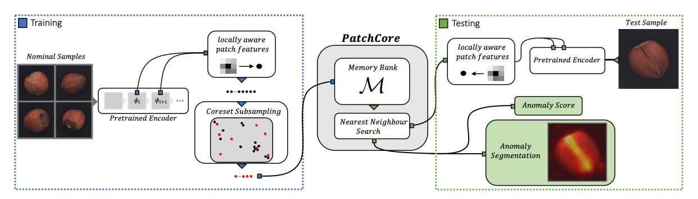

# PatchCore

## 정상 이미지로 이상 이미지 찾기

- Roth et al., CVPR 2022

---

# 용어 정리

| 용어 | 쉬운 뜻 |
|---|---|
| 정상 이미지 | 결함이 없는 제품 이미지 |
| 이상 이미지 | 결함이 있는 제품 이미지 |
| 이상 탐지 | 이상 이미지를 찾아내는 일 |
| patch | 사진을 나눈 작은 사각 조각 |
| feature | AI가 사진의 모양·무늬를 숫자로 바꾼 정보 |
| 정상 memory bank | 정상 patch의 feature를 모아 둔 저장소 |
| 위치 추정 | 이미지에서 이상 위치를 찾는 일 |

---

# 1. 논문이 풀려는 문제

- 공장에서는 정상 이미지는 쉽게 얻을 수 있음
- 이상은 종류가 많고 드물어서 모든 이상 이미지를 모으기 어려움
- 그래서 정상 이미지만 보고 테스트 이미지가 정상인지 이상인지 판단해야 함
- 이상은 얇은 긁힘처럼 작을 수도 있고, 부품 누락처럼 클 수도 있음

---

# 2. PatchCore의 핵심 생각

정상 이미지를 patch로 나누고, 각 patch의 feature를 기억해 둠.

테스트 이미지의 patch가 정상 memory bank의 patch들과 많이 다르면, 그 patch를 이상으로 봄.

```text
정상 이미지 → patch feature를 정상 memory bank에 저장
테스트 이미지 → 정상 memory bank와 비교 → 많이 다르면 이상
```

---

# 3. 어떻게 작동하는가?


## ① 정상 patch의 feature 뽑기

- ImageNet으로 미리 학습된 ResNet 계열 network 사용함
- 마지막 계층이 아니라 중간 계층 feature map 사용함. 논문 예시는 `j = 2, 3` 계층임
- feature map의 모든 위치 `(h, w)`에서 하나의 feature vector 꺼냄
- 각 위치 주변 `p × p` 이웃 feature를 **adaptive average pooling**으로 평균냄
- 평균낸 값 하나가 그 위치의 locally aware patch feature가 됨
- stride는 기본값 `1` 사용. 따라서 feature map의 공간 해상도 유지됨

```text
정상 이미지
  → 중간 계층 feature map
  → 각 위치 주변 feature 평균
  → 위치별 patch feature 생성
```

중간 계층을 쓰는 이유는, 너무 깊은 계층은 위치 정보가 줄고 ImageNet 분류에 치우칠 수 있기 때문임

## ② 대표 정상 patch 고르기

- 모든 정상 이미지의 patch feature를 합쳐 정상 memory bank `M` 만듦
- `M` 전체를 그대로 쓰면 저장 공간과 최근접 이웃 검색 시간이 너무 커짐
- 임의로 일부를 뽑으면 정상 feature 공간의 중요한 부분이 빠질 수 있음
- 그래서 논문은 **minimax facility-location coreset**으로 대표 부분집합 `M_C`를 고름

## Greedy coreset 선택 절차

```text
1. 정상 memory bank에서 대표 patch를 하나씩 선택함
2. 아직 선택되지 않은 patch마다,
   이미 선택된 대표 patch 중 가장 가까운 것까지의 거리 계산함
3. 그 거리도 가장 큰 patch를 다음 대표 patch로 선택함
4. 목표 개수가 될 때까지 반복함
```

- 이미 고른 대표 patch들과 **가장 다른 patch**를 계속 추가하는 방식임
- 그래서 비슷한 정상 patch를 중복 저장하는 대신, 정상 feature 공간을 넓게 덮는 patch들을 남김
- exact coreset 계산은 NP-hard라서 논문은 greedy 근사 사용함
- 선택 속도를 줄이기 위해 feature 차원을 random linear projection으로 먼저 낮춤

## ③ 테스트 patch와 비교하기

- 테스트 patch와 가장 비슷한 정상 patch를 찾음
- 두 patch feature의 **직선 거리**를 계산함
- 테스트 이미지의 patch 중 정상 memory bank에서 가장 먼 patch를 이미지 수준 이상 점수 계산에 사용함
- 이 patch 주변 정상 memory bank의 이웃 관계를 이용해 이상 점수를 재가중함
- 모든 patch 이상 점수를 원래 위치에 다시 놓고, bilinear interpolation과 Gaussian smoothing을 적용해 위치 추정 지도(segmentation map) 만듦
  → 원본 제품 사진 위로 불량 의심 부위가 붉게 물들어 있는 부드러운 열화상 형태의 지도(히트맵)가 완성


---

# 4. 무엇을 판단하는가?

| 판단 | 논문에서 하는 일 |
|---|---|
| 이미지 수준 탐지 | 이미지 전체가 정상인지 이상인지 판단 |
| 위치 추정 | 이미지의 어느 위치가 이상인지 표시 |

- patch 하나만 이상해도 이미지 전체를 이상으로 판단할 수 있음
- 각 patch 이상 점수를 원래 위치에 표시해 위치 추정 지도 만듦

---

# 5. 실험

- MVTec AD와 Magnetic Tile Defects(MTD) 데이터셋에서 평가
- 정상 이미지로 정상 memory bank 구성
- 정상 이미지와 이상 이미지로 이루어진 테스트 이미지로 성능 측정

| 지표 | 의미 |
|---|---|
| Image AUROC | 정상 이미지와 이상 이미지를 구분하는 성능 |
| Pixel AUROC | 이상 위치를 구분하는 성능 |
| PRO | 실제 이상 영역을 얼마나 잘 찾는지 보는 성능 |

---

# 6. 논문의 결과

- MVTec AD에서 이미지 수준 AUROC 최대 **99.6%** 보고함
- 논문은 이전 방법(당시 제조업 비전 검사 분야에서 최고 성능을 기록하고 있던 알고리즘)보다 detection error를 절반 이상 줄였다고 보고함
- 탐지와 위치 추정 모두에서 높은 성능 보고함
- 적은 정상 학습 이미지를 쓰는 조건에서도 결과 제시함

---

# 7. 한 줄 결론

PatchCore는 대표 정상 patch를 정상 memory bank에 기억해 두고,
테스트 patch가 정상 patch와 얼마나 다른지로 이상 이미지와 이상 위치를 찾는 방법임.

---
