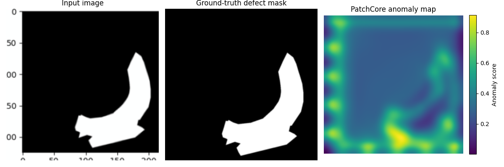
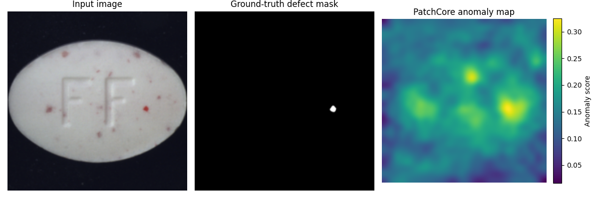
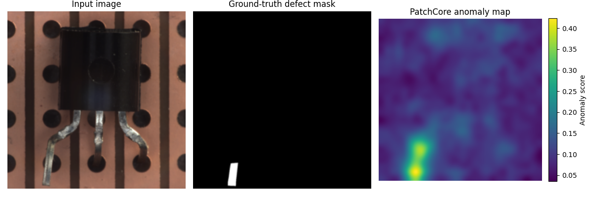

# PatchCore MVTec AD 재현 결과

## 목적

PatchCore 논문 [1]의 공개 구현체를 MVTec AD 15개 category에서 실행하고, 논문 예시 baseline과 비교함.

## 결과 바로 열기

- [15개 category baseline 표 (CSV)](../source/results/PatchCore_MVTecAD_IM224_WR50_baseline.csv)
- [10% 대 1% coreset 비교 표 (CSV)](../source/results/PatchCore_MVTecAD_IM224_WR50_coreset_comparison.csv)
- [W31 미팅 brief](../../meetings/2026-W31_brief.md)
- [실행 스크립트](../source/run_patchcore_mvtec.ps1)

## 재현 조건

- upstream: `amazon-science/patchcore-inspection`
- revision: `fcaa92f124fb1ad74a7acf56726decd4b27cbcad`
- backbone: WideResNet-50 (`layer2`, `layer3`)
- input size: 224
- patch size: 3
- normal memory coreset: 10%
- nearest neighbor: 1
- seed: 0

실행 절차는 [PatchCore_reproduction_setup.md](PatchCore_reproduction_setup.md)에 정리함.

## 논문 예시와 비교

| 측정 항목 | 논문 예시 [1] | 이번 재현 | 차이 |
|---|---:|---:|---:|
| Image AUROC | 0.9920 | 0.9910 | -0.0010 |
| Pixel AUROC | 0.9810 | 0.9812 | +0.0002 |

15개 category별 수치는 [baseline CSV](../source/results/PatchCore_MVTecAD_IM224_WR50_baseline.csv)에 있음. 현재 환경의 평균 결과는 논문 예시와 매우 가까움.

## Coreset 비율 비교

| Coreset 비율 | Image AUROC | Pixel AUROC |
|---|---:|---:|
| 10% | 0.9910 | 0.9812 |
| 1% | 0.9896 | 0.9798 |

정상 특징을 10%에서 1%로 줄이면 두 점수 모두 약 0.14%p 감소함. category별 비교 수치는 [comparison CSV](../source/results/PatchCore_MVTecAD_IM224_WR50_coreset_comparison.csv)에 있음.

## 대표 히트맵 사례

각 그림은 왼쪽부터 `Input image`(테스트 원본), `Ground-truth defect mask`(실제 결함 위치), `PatchCore anomaly map`(예측 이상 점수 지도)임.

- 정답 마스크의 흰색 영역은 실제 결함 위치임.
- 이상 지도는 보라색일수록 낮고 노란색일수록 높은 이상 점수임.
- 색 막대의 수치는 해당 이미지 안의 점수 범위이므로, 서로 다른 그림의 색만으로 절대 점수를 직접 비교하면 안 됨.

| 사례 | 관찰 |
|---|---|
| bottle / broken_large | 파손 부분에 높은 이상 점수가 모임 |
| pill / color | 작은 색 점 결함 외의 표면 점에도 반응함 |
| transistor / bent_lead | 휘어진 다리 끝에 높은 이상 점수가 모임 |

## 재현 환경의 변경과 한계

- Windows CPU FAISS 검색의 메모리 오류를 피하기 위해 query를 128개씩 나눠 검색함. 거리 정의와 최근접 이웃 선택은 바꾸지 않았음.
- Windows 경로와 현재 torchvision 전처리 구조에 맞게 히트맵 저장 코드에 작은 호환성 수정을 적용함.
- 따라서 논문 저자의 원래 환경과 bitwise 동일한 실행이라고 주장할 수는 없음.

## 참고문헌

[1] Karsten Roth et al. “Towards Total Recall in Industrial Anomaly Detection.” *Proceedings of the IEEE/CVF Conference on Computer Vision and Pattern Recognition*, 2022.
