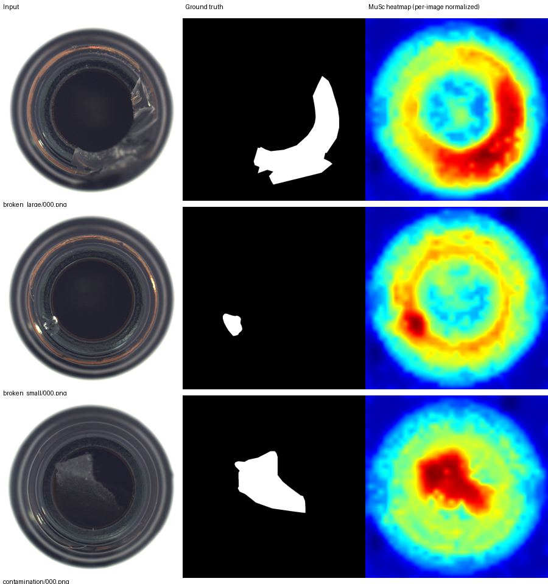

# MuSc 논문과 내 PC 실행 결과 비교

작성일: 2026-10-02. 비교 범위: **MVTec AD `bottle` 한 category**.

후속 실행: MVTec AD 15개 category 평가를 완료했다. 전체 결과는 [전체 category 논문 비교](MuSc_paper_vs_local_mvtec_all.md)에 정리했다. 이 문서는 첫 bottle 실행의 비교 기록을 유지한다.

현재 실행은 논문의 bottle 결과와 가깝다. 이미지 분류 지표는 논문과 같은 소수점 한 자리로 반올림하면 모두 일치하며, 위치 검출 지표는 논문 보고값보다 조금 낮다. 가장 큰 차이는 Pixel F1-max의 −0.4327%p다. 아직 전체 데이터셋 재현이나 차이의 원인을 검증한 상태는 아니다.

## 1. 비교 근거

| 구분 | 출처 |
|---|---|
| 논문 | [ICLR 2024 공식 PDF](../paper/ICLR24_MuSc_Zero_Shot_Industrial_Anomaly_Classification_and_Segmentation_with_Mutual_Scoring_of_the_Unlabeled_Images.pdf), **p.20, Appendix A.7, Table 17의 bottle 행** [1] |
| 내 실행 | [metrics.csv](../source/results/bottle_paper_20261002/metrics.csv), 2026-10-02 RTX 5080에서 측정 |
| 비교 raw table | [paper_vs_local.csv](../source/results/bottle_paper_20261002/paper_vs_local.csv) |
| 설정 / 환경 | [config.json](../source/results/bottle_paper_20261002/config.json), [environment.json](../source/results/bottle_paper_20261002/environment.json) |
| 이미지별 출력 | [image_scores.csv](../source/results/bottle_paper_20261002/image_scores.csv) |

논문 Table 1의 MVTec AD 평균과 내 bottle 결과를 비교하지 않았다. 같은 category인 Table 17의 bottle 행을 사용했다. 논문 숫자는 비교 기준으로만 사용하며 내 실행 결과로 대체하거나 섞지 않는다.

## 2. 지표별 비교

값의 단위는 %. **Δ = 내 실행 − 논문**, 단위는 **percentage point(%p)**다. 양수는 내 실행이 높고 음수는 낮다는 뜻이다. 모든 지표는 높을수록 좋다.

| 지표 | 논문 bottle (%) | 내 실행 (%) | Δ (%p) | 내 실행을 소수점 1자리로 표시 |
|---|---:|---:|---:|---:|
| Image AUROC | 99.9 | 99.9206 | +0.0206 | 99.9 |
| Image F1-max | 99.2 | 99.2126 | +0.0126 | 99.2 |
| Image AP | 100.0 | 99.9752 | −0.0248 | 100.0 |
| Pixel AUROC | 98.6 | 98.4773 | −0.1227 | 98.5 |
| Pixel F1-max | 79.6 | 79.1673 | −0.4327 | 79.2 |
| Pixel AP | 83.2 | 83.0416 | −0.1584 | 83.0 |
| PRO / AUPRO | 96.2 | 96.1027 | −0.0973 | 96.1 |

論文은 소수점 한 자리만 공개하므로 Δ는 **공개된 반올림 값 기준의 차이**다. 논문의 미반올림 raw 값과의 정확한 차이로 해석하면 안 된다. Image AP 100.0도 이 표만으로 완벽한 순위 판별이라고 단정할 수 없다. 내 CSV는 0–1 단위이며 위 표에서는 100을 곱했다.

논문 Table 17은 마지막 지표를 `PRO-segm`으로 표기하고, 실행 코드는 `aupro`를 출력한다. 실행의 실제 계산은 PRO–FPR curve의 면적이다. 공식 구현은 200개 threshold에서 FPR<0.3인 점들을 선택하고, 선택된 FPR 범위를 min–max 정규화해 적분한다. 따라서 다른 라이브러리의 AUPRO와 비교하려면 계산 정의도 확인해야 한다.

## 3. 논문과 동일하게 유지한 조건

| 항목 | 논문 / 공식 구현 조건 | 내 실행 |
|---|---|---|
| 방법 | MuSc zero-shot | 동일, 추가 학습 없음 |
| Backbone | OpenAI CLIP ViT-L/14-336 | 동일 |
| 입력 해상도 | 518×518 | 동일 |
| Feature stage | 6·12·18·24번째 layer | 동일, 코드 index `[5,11,17,23]` |
| LNAMD aggregation | `{1,3,5}` | 동일 |
| MSM | 다른 이미지마다 최근접 patch 거리, 낮은 30% 평균 | 공식 구현 그대로 |
| RsCIN | MVTec 이웃 window 2·3 및 원점수 항 | 공식 코드의 `[1,2,3]` 그대로 |
| Test pool | category별 unlabeled test images | bottle 83장 전체, 분할 없음 |
| 정상 train 사용 | 없음 | 없음 |
| Feature 추출 batch | 현재 공식 config의 4 | 4; 논문 본문에서 batch 값은 확인되지 않음 |

현재 bottle test는 정상 20장, 이상 63장이고 이상 이미지의 정답 마스크 누락은 0이다. Test 라벨과 mask는 metric 계산에 사용하며 MuSc scoring 입력으로 사용하지 않는다.

## 4. 내 환경에 맞게 달라진 조건

| 항목 | 논문 / 원문 확인 범위 | 내 실행 |
|---|---|---|
| GPU | 효율 측정은 RTX 3090으로 명시 | RTX 5080, VRAM 약 16GB |
| 실행 시스템 | 논문에서 상세 OS 버전 미확인 | WSL2 Linux, Windows host |
| Python | 논문에서 버전 미확인 | 3.12.13 |
| PyTorch / CUDA | 논문에서 정확한 버전 미확인 | 2.11.0+cu128 / CUDA 12.8 |
| 공식 code 버전 | 출판 결과 생성 commit 미확인 | `b76b93da8bd3096a99964a96ae29d46f197a0651` |
| Dependency | 논문 당시 전체 환경 미확인 | timm 1.0.28, NumPy 2.5.3, scikit-learn 1.9.0, scikit-image 0.26.0 등 |
| Seed / 연산 설정 | 논문 수치의 세부 설정 미확인 | seed 42, TF32 비활성화, 공식 CUDA autocast 유지 |

저자의 scoring·loader·metric 소스를 수정하지 않고 실행했다. 별도 래퍼는 원시 배열·CSV·환경 저장 기능을 추가했다. 최신 GPU에서 동작하는 기존 환경을 유지했으므로 당시 dependency 버전과 동일하다는 주장은 하지 않는다.

## 5. 시간·메모리는 직접 우열 비교할 수 없음

| 측정 | 내 실행 값 | 해석 범위 |
|---|---:|---|
| 전체 wall time | 75.1078초 | 모델 로딩, scoring, raw 저장, 지표 계산, 시각화 포함 |
| 공식 로그의 MuSc 시간 | 376.6247ms/image | bottle 83장에 대한 upstream 측정값 |
| PyTorch peak allocated | 6,756,543,488 bytes ≈ 6.29GiB | 모델 로딩 후 peak reset한 allocator 통계 |
| PyTorch peak reserved | 7,610,564,608 bytes ≈ 7.09GiB | PyTorch 예약 메모리, 전체 GPU 사용량과 다름 |

논문 Tables 6/13은 별도 GPU와 pool 조건에서 측정한 효율 결과다. 현재 값은 bottle 한 번의 실행이며 warm-up·반복·동일한 timing 경계 및 메모리 계측 기준을 맞추지 않았다. 따라서 이 문서에서는 속도 향상 배수나 GPU 메모리 절감률을 계산하지 않는다. 정식 비교에는 dataset/pool, precision, code commit, warm-up, CUDA 동기화, 시간 포함 범위, 메모리 측정 방식을 고정한 별도 실험이 필요하다.

## 6. 차이의 원인과 현재 판단

**관찰:** 이미지 분류 3개 지표는 공개 정밀도에서 일치하고, segmentation 4개 지표는 모두 조금 낮다. 점수·map에는 NaN/Inf가 없고 83개 이미지의 결과가 모두 저장됐다.

**원인 후보, 아직 미검증:** 공식 코드의 출판 이후 변경, library 버전, GPU/혼합 정밀도에 따른 수치 차이, 데이터/마스크 resize 및 metric 세부 처리의 차이. 이번에 같은 환경에서 하나씩 바꿔 비교하지 않았으므로 어느 하나를 원인으로 확정할 수 없다. 하드웨어가 다르다는 사실만으로 성능 차이를 설명할 수도 없다.

**주장 가능한 것:** 이 PC에서 공식 MuSc를 논문의 주요 설정으로 실행했고, bottle의 공개 결과에 가까운 실제 지표를 확보했다.

**아직 주장할 수 없는 것:** MVTec 전체 평균 재현, VisA 재현, 모든 category에서의 일치, 논문 대비 통계적으로 유의한 성능 향상/하락, 논문보다 빠르다는 결론.

다음 검증은 같은 설정으로 MVTec 15개 category를 실행해 Table 17 전체를 비교하는 것이다. 차이가 큰 category는 저장된 map·이미지별 score를 먼저 확인하고, 전처리·metric·코드 버전 후보를 하나씩 고정해 진단한다.

## 7. 재현 경로와 실제 결과 이미지

- commit: `b76b93da8bd3096a99964a96ae29d46f197a0651`
- sh: [run_baseline.sh](../source/run_baseline.sh)
- result: [metrics.csv](../source/results/bottle_paper_20261002/metrics.csv)
- 실행 래퍼: [run_musc_local.py](../source/run_musc_local.py)
- 원시 출력: `/home/test/musc_results/bottle_paper_20261002/raw_predictions.npz`
- command log: `/home/test/musc_results/bottle_paper_20261002/run.log`
- [실행 상세 보고서](MuSc_bottle_local_execution.md)

그림 근거: [preview_manifest.json](../source/results/bottle_paper_20261002/preview_manifest.json), [생성 script](../source/make_preview.py). 색상 강도는 이미지 간 절대 점수 비교용이 아니다.

## 참고문헌

[1] Li, Xurui, et al. "MuSc: Zero-Shot Industrial Anomaly Classification and Segmentation with Mutual Scoring of the Unlabeled Images." International Conference on Learning Representations, 2024.
