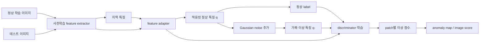

# SimpleNet: A Simple Network for Image Anomaly Detection and Localization

> **한 줄 요약:** SimpleNet은 정상 이미지의 특징 주변에 작은 Gaussian noise를 더해 가짜 이상 특징을 만들고, 정상과 가짜 이상을 구분하는 판별기를 학습하는 비지도 산업 이상 탐지 방법이다.

| 항목 | 내용 |
|---|---|
| 논문 | *SimpleNet: A Simple Network for Image Anomaly Detection and Localization* |
| 저자 | Zhikang Liu, Yiming Zhou, Yuansheng Xu, Zilei Wang |
| 학회 | CVPR 2023 |
| 문제 | 정상 이미지로만 학습해 이미지 이상 탐지와 결함 위치 추정을 수행 |
| 핵심 | 특징 공간의 synthetic anomaly + 단순 discriminator |

---

## 1. 왜 산업 이상 탐지가 어려운가

산업 검사에서 불량 예시는 적고, 실제 결함의 형태도 미리 모두 알 수 없다. 따라서 학습에는 보통 정상 이미지뿐이며, 모델은 정상과 다른 입력을 이상으로 찾아야 한다.

이 문제에는 두 가지 목표가 있다.

1. **Image-level anomaly detection**: 제품 이미지 전체가 정상인지 불량인지 판단한다.
2. **Pixel-level anomaly localization**: 이미지 안에서 이상이 있는 위치를 표시한다.

| 지표 | 단위 | 높을수록 의미하는 것 |
|---|---|---|
| I-AUROC | 이미지 | 이상 이미지가 정상 이미지보다 높은 점수를 받음 |
| P-AUROC | 픽셀 | 실제 결함 pixel이 정상 pixel보다 높은 점수를 받음 |

---

## 2. 기존 접근과 SimpleNet의 관점

| 접근 | 핵심 아이디어 | 어려움 |
|---|---|---|
| 복원 기반 | 정상 이미지를 복원하고 입력과 복원의 차이로 이상 탐지 | 모델이 이상도 잘 복원하면 놓칠 수 있음 |
| 이미지 합성 기반 | 정상 이미지에 가짜 결함을 합성해 분류 학습 | 합성 결함이 실제 결함과 다를 수 있음 |
| 임베딩 기반 | 정상 특징 분포 또는 normal memory와 테스트 특징을 비교 | memory 저장·최근접 검색 또는 통계 계산 필요 |

SimpleNet은 **이미지 공간이 아닌 특징 공간(feature space)** 에서 가짜 이상을 만든다. 사전학습 모델이 추출한 정상 특징에 작은 noise를 더한 뒤, 정상과 가짜 이상 특징의 경계를 학습한다.

---

## 3. 전체 구조

- 가짜 이상 특징은 **학습 때만** 사용한다.
- 추론 때는 feature extractor, adapter, discriminator만 사용한다.

---

## 4. 단계 1 — 사전학습 특징에서 지역 정보 추출

SimpleNet은 ImageNet으로 사전학습된 **WideResNet-50**을 backbone으로 사용한다.

- 두 번째와 세 번째 중간 계층(`layer2`, `layer3`)의 feature map을 사용한다.
- 각 위치 주변의 `p × p` 특징을 평균 내어 지역 특징(local feature)을 구성한다.
- 크기가 다른 feature map의 해상도를 맞춘 뒤 채널 방향으로 결합한다.
- 기본 설정에서 지역 특징의 차원은 **1,536**이다.

`layer2`는 세밀한 국소 정보에, `layer3`는 더 넓은 문맥 정보에 기여한다. 논문은 두 계층을 함께 사용한 설정을 기본값으로 채택했다.

---

## 5. 단계 2 — feature adapter로 산업 도메인에 맞춤

ImageNet 특징은 일반 이미지에 유용하지만 산업 검사 이미지에 완전히 맞지는 않을 수 있다. SimpleNet은 feature adapter로 지역 특징을 현재 도메인에 맞게 조정한다.

`q = Gθ(o)`

| 기호 | 의미 |
|---|---|
| `o` | backbone이 추출한 지역 특징 |
| `Gθ` | feature adapter |
| `q` | 적응된 정상 특징 |

- 기본 adapter는 **bias 없는 단일 fully-connected layer**다.
- 입력과 출력 차원은 같다.
- backbone은 고정하고 adapter와 discriminator만 학습한다.

논문 ablation에서 복잡한 비선형 adapter보다 단일 FC adapter가 더 좋은 성능을 보였다고 보고했다.

---

## 6. 단계 3 — 정상 특징으로 가짜 이상 특징 만들기

실제 이상 예시는 학습 데이터에 없으므로, 적응된 정상 특징 `q`에 Gaussian noise를 더해 가짜 이상 특징을 만든다.

`q⁻ = q + ε`, `ε ~ N(0, σ²)`

| 기호 | 의미 |
|---|---|
| `q` | 적응된 정상 특징 |
| `q⁻` | 가짜 이상 특징 |
| `ε` | Gaussian noise |
| `σ` | noise의 표준편차 |

기본 설정은 `σ = 0.015`다.

- noise가 너무 크면 가짜 이상이 정상 특징에서 너무 멀어져 경계가 느슨해질 수 있다.
- noise가 너무 작으면 학습이 불안정해지거나 정상 특징에 대한 일반화가 약해질 수 있다.

---

## 7. 단계 4 — discriminator가 정상과 가짜 이상을 구분

discriminator는 각 patch 특징에 대해 정상에 가까운 정도를 점수 하나로 출력한다.

- 적응된 정상 특징 `q`에는 **높은 정상 점수**가 나오도록 학습한다.
- 가짜 이상 특징 `q⁻`에는 **낮은 정상 점수**가 나오도록 학습한다.
- 구조는 `Linear → Batch Normalization → Leaky ReLU → Linear`다.
- 손실은 절단된 L1 loss를 사용한다. 정상과 가짜 이상의 점수가 충분히 분리되면 더 과도하게 밀지 않는다.

기본 학습 설정은 Adam optimizer, adapter learning rate `0.0001`, discriminator learning rate `0.0002`, weight decay `0.00001`, 범주별 160 epoch, batch size 4다.

---

## 8. 추론 — discriminator 점수를 anomaly score로 사용

테스트에서는 Gaussian noise를 더하지 않는다.

1. 테스트 이미지를 backbone과 adapter에 넣어 patch별 특징 `q`를 얻는다.
2. discriminator의 정상 점수에 마이너스를 붙여 patch anomaly score로 사용한다.
3. patch 점수를 입력 이미지 크기로 보간하고 Gaussian filter(`σ=4`)로 부드럽게 해 anomaly map을 만든다.
4. anomaly map에서 가장 높은 patch 점수를 image-level anomaly score로 사용한다.

`patch anomaly score = -Dψ(q)`

따라서 discriminator가 “정상이 아니다”라고 보는 patch일수록 anomaly score가 높다.

---

## 9. MVTec AD에서의 논문 결과

논문은 MVTec AD에서 다음 전체 평균을 보고했다.

| 방법 | I-AUROC | P-AUROC |
|---|---:|---:|
| PatchCore | 99.1% | 98.1% |
| **SimpleNet** | **99.6%** | **98.1%** |

- SimpleNet은 image-level I-AUROC에서 99.6%를 보고했다.
- pixel-level P-AUROC는 98.1%를 보고했다.
- 논문은 동일 하드웨어에서 SimpleNet이 77 FPS이며 PatchCore보다 약 8배 빠르다고 보고한다.

이 수치는 논문 저자 환경에서 보고된 결과다.

---

## 10. PatchCore와의 핵심 차이

| 항목 | PatchCore | SimpleNet |
|---|---|---|
| 정상 정보를 담는 방식 | 대표 정상 patch를 memory bank에 저장 | adapter와 discriminator의 파라미터에 경계를 학습 |
| 이상 점수 | normal memory와의 최근접 거리 | discriminator 정상 점수의 반대값 |
| 가짜 이상 | 사용하지 않음 | 정상 특징에 Gaussian noise를 추가 |
| 테스트 비용 | 최근접 이웃 검색 필요 | 단일 네트워크 흐름으로 점수 계산 |

두 방법 모두 WideResNet-50의 중간 특징을 활용하고, 정상 학습 이미지만으로 범주별 모델을 만든다는 공통점이 있다.

---

## 11. 결론

- SimpleNet은 정상 특징 주변에 synthetic anomaly를 만들어 **특징 공간의 정상/이상 경계**를 학습한다.
- feature adapter는 사전학습 특징을 산업 이미지 도메인에 맞게 조정한다.
- 추론에서는 normal memory의 최근접 검색 대신 discriminator 점수를 사용한다.
- 논문의 기본 구성은 `WideResNet-50 layer2+layer3`, 단일 FC adapter, `σ=0.015` noise, discriminator다.

핵심 메시지는 다음과 같다.

> **실제 결함 예시가 없어도, 정상 특징 주변에 만든 가짜 이상을 이용해 이상 탐지와 위치 추정을 함께 학습할 수 있다.**

---

## 참고문헌

[1] Liu, Zhikang, et al. "SimpleNet: A Simple Network for Image Anomaly Detection and Localization." *Proceedings of the IEEE/CVF Conference on Computer Vision and Pattern Recognition*, 2023, pp. 20402-20411.

[2] Bergmann, Paul, et al. "MVTec AD: A Comprehensive Real-World Dataset for Unsupervised Anomaly Detection." *Proceedings of the IEEE/CVF Conference on Computer Vision and Pattern Recognition*, 2019, pp. 9592-9600.

[3] Roth, Karsten, et al. "Towards Total Recall in Industrial Anomaly Detection." *Proceedings of the IEEE/CVF Conference on Computer Vision and Pattern Recognition*, 2022, pp. 14318-14328.
