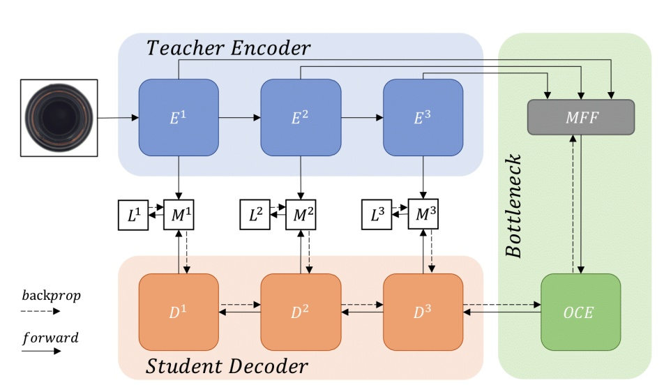

## Paper Metadata

| Item | Content |
|---|---|
| Title | *Anomaly Detection via Reverse Distillation from One-Class Embedding* |
| Authors | Hanqiu Deng, Xingyu Li |
| Conference / Journal | Proceedings of the IEEE/CVF Conference on Computer Vision and Pattern Recognition (CVPR) |
| Year | 2022 |
| Paper link | https://openaccess.thecvf.com/content/CVPR2022/papers/Deng_Anomaly_Detection_via_Reverse_Distillation_From_One-Class_Embedding_CVPR_2022_paper.pdf |
| GitHub / Official code | https://github.com/hq-deng/RD4AD |
| Reason for investigation | PatchCore의 normal memory 거리 기반 접근 및 SimpleNet의 synthetic anomaly 판별 기반 접근과 비교할 수 있는, memory bank 없이 teacher-student feature discrepancy를 이용하는 방법을 확인하기 위함. |

---

# RD4AD: Reverse Distillation from One-Class Embedding

## 1. 이 논문이 다루는 문제

RD4AD는 정상 이미지만으로 학습해 테스트 이미지의 이상 여부와 이상 위치를 찾는 unsupervised anomaly detection 방법이다 [1].

| 구분 | 입력 | 출력 | 제약 | 평가 |
|---|---|---|---|---|
| Image-level detection | 테스트 이미지 1장 | image anomaly score | 정상 train 이미지만 사용 | I-AUROC |
| Pixel-level localization | 테스트 이미지 1장 | pixel별 anomaly map | 실제 결함 예시 없이 학습 | P-AUROC, PRO |

기존 knowledge distillation 기반 방법은 teacher와 student가 비슷한 encoder 구조를 쓰고 동일한 raw image를 입력으로 받는 경우가 많다. 논문은 이 구조에서는 이상 입력에서도 teacher와 student의 특징 차이가 충분히 커지지 않을 수 있다고 본다 [1].

---

## 2. 핵심 아이디어: encoder teacher에서 decoder student로 역방향 distillation


RD4AD는 고정된 teacher encoder의 다중 해상도 특징을, 낮은 차원의 one-class embedding을 거쳐 student decoder가 복원하도록 학습한다.



- 파란색 `Teacher Encoder`는 입력 이미지에서 세 scale의 특징 `E¹`, `E²`, `E³`를 추출하며, 학습 중 고정됨.
- 초록색 `Bottleneck`은 MFF가 세 scale 특징을 합치고 OCE가 이를 compact one-class embedding으로 압축하는 부분임.
- 주황색 `Student Decoder`는 bottleneck에서 시작해 `D³ → D² → D¹` 순으로 teacher 특징을 복원함. 각 scale에서 teacher와 student의 차이 `M¹`, `M²`, `M³`가 클수록 해당 위치를 이상으로 봄.

```text
정상 이미지
  → 고정된 ImageNet-pretrained teacher encoder E
  → multi-scale teacher features
  → multi-scale feature fusion (MFF)
  → one-class embedding (OCE): compact bottleneck ϕ
  → trainable student decoder D
  → teacher / student feature similarity loss
```

테스트 시 teacher는 입력의 이상 특징도 그대로 추출한다. 반면 student decoder는 정상 데이터에서 학습한 compact embedding으로 teacher 특징을 복원하므로, 이상 입력의 특징을 충분히 복원하지 못할 것으로 기대한다. 이 teacher-student 특징 차이를 anomaly score로 사용한다 [1].

`Mᵏ(h, w) = 1 - cos(f_Eᵏ(h, w), f_Dᵏ(h, w))`

- `f_Eᵏ`, `f_Dᵏ`: k번째 scale에서 teacher와 student의 위치별 feature vector
- `Mᵏ`: 위치별 cosine-distance anomaly map; 클수록 이상 가능성이 높음

---

## 3. 방법 구성

### 3.1 Reverse distillation 구조

- **Teacher `E`**: ImageNet 사전학습 encoder이며 학습 중 고정함.
- **Student `D`**: teacher와 대칭적이지만 방향이 반대인 decoder 구조임. teacher의 downsampling에 대응해 deconvolution 기반 upsampling을 사용함.
- **Reverse의 의미**: 고수준·저해상도 표현에서 시작해 student decoder가 저수준·고해상도 특징을 복원함.

논문은 teacher와 student의 구조·정보 흐름을 다르게 해, 이상 입력에서 두 네트워크의 반응이 지나치게 비슷해지는 문제를 줄이려 한다 [1].

### 3.2 One-Class Bottleneck Embedding (OCBE)

OCBE는 두 블록으로 구성된다.

| 블록 | 역할 |
|---|---|
| Multi-scale Feature Fusion (MFF) | teacher의 얕은·깊은 특징을 해상도와 채널을 맞춰 결합함 |
| One-Class Embedding (OCE) | 결합된 특징을 낮은 차원의 compact code `ϕ`로 압축함 |

skip connection처럼 teacher 특징을 student로 직접 전달하면 이상 정보도 함께 전달될 수 있다. RD4AD는 이를 피하고, compact bottleneck이 정상 패턴 복원에 필요한 정보는 남기되 이상 perturbation의 전달은 억제하도록 설계한다 [1].

### 3.3 학습과 anomaly scoring

- 학습은 정상 train 이미지에서 teacher와 student의 대응 feature가 유사해지도록 multi-scale cosine similarity loss를 최소화함.
- 추론에서는 각 scale의 `Mᵏ`를 입력 해상도로 bilinear upsampling한 뒤 합산하고 Gaussian filter로 smoothing해 pixel anomaly map을 만듦.
- pixel anomaly map의 최댓값을 image-level anomaly score로 사용함. 작은 이상 영역이 평균에서 희석되는 것을 피하기 위한 선택임 [1].

---

## 4. 논문이 주장하는 결과

MVTec AD에서 WideResNet-50 teacher와 256×256 입력을 사용한 논문 보고값은 다음과 같다 [1, Tables 1-3].

| 지표 | RD4AD 보고값 | 의미 |
|---|---:|---|
| I-AUROC | 98.5% | 정상·이상 이미지를 구분하는 성능 |
| P-AUROC | 97.8% | 결함 pixel을 구분하는 성능 |
| PRO | 93.9% | 실제 결함 영역을 region 단위로 찾는 성능 |
| 추론 시간 | 0.31 s / image | Intel i7에서의 논문 측정값 |
| 메모리 | 352 MB | 논문 측정값 |

논문은 같은 표에서 PaDiM(WideResNet-50)의 I-AUROC / P-AUROC / PRO를 95.5% / 97.5% / 92.1%로, 추론 시간과 메모리를 0.95초 및 3,800 MB로 보고한다. 이 비교는 memory bank 기반 사전학습 특징 방법에 비해 RD4AD가 memory와 추론 시간을 줄일 수 있다는 논문의 근거다 [1, Table 3].

위 수치는 **논문 저자 환경의 보고값**이다. 이 related-work note는 별도 재현 결과를 포함하지 않는다.

---

## 5. PatchCore·SimpleNet과의 비교

| 항목 | PatchCore [2] | SimpleNet [3] | RD4AD [1] |
|---|---|---|---|
| 정상 정보를 담는 방식 | 대표 정상 patch를 memory bank에 저장 | adapter·discriminator에 경계를 학습 | OCBE·student decoder에 정상 feature 복원을 학습 |
| 이상 점수 | memory와의 최근접 거리 | discriminator 정상 점수의 반대값 | teacher·student feature의 cosine distance |
| 학습 신호 | memory 구성, 별도 model 학습 없음 | 정상 vs. Gaussian-noise synthetic anomaly 분류 | 정상 teacher feature의 multi-scale 복원 |
| 테스트 비용 | 최근접 이웃 검색 | network forward | teacher + OCBE + student decoder forward |
| 특징적 설계 | coreset으로 memory 축소 | feature-space pseudo anomaly | reverse encoder-decoder distillation + bottleneck |

세 방법 모두 사전학습 CNN 특징과 정상 train 이미지를 사용하지만, **정상성을 표현하는 방식**이 각각 memory, 판별 경계, 복원 가능한 compact representation으로 다르다.

---

## 6. 이 논문을 참고 연구로 남기는 이유

RD4AD는 현재 산업 이상 탐지 비교에서 다음 질문을 구체화한다.

1. normal memory 검색 없이도 normality를 충분히 표현할 수 있는가?
2. feature-space reconstruction discrepancy는 거리 기반 또는 판별기 기반 점수와 어떤 성능·속도·메모리 trade-off를 갖는가?
3. compact bottleneck이 실제 이상 정보를 억제한다면, image-level과 pixel-level 성능은 함께 개선되는가?

이 note는 RD4AD의 원리와 비교 축을 기록한 것이다. 현재 연구에서 RD4AD를 채택하거나 성능을 주장하는 근거는 아니며, 그런 판단에는 동일 protocol에서의 재현·비교 실험과 raw result가 필요하다.

---

## 7. 제한과 확인할 점

| 항목 | 논문에서 보이는 제한 또는 확인점 |
|---|---|
| 이상 정보 억제 가정 | bottleneck이 이상 perturbation을 버릴 것이라는 기대에 의존하며, 실제 이상 특징을 직접 감독하지 않음 |
| context 관계 | 논문은 `transistor`의 낮은 localization 성능을 예측 위치와 annotation의 불일치, 그리고 문맥 관계 부족과 연결해 설명함 [1] |
| multi-scale 설정 | 어떤 feature layer를 사용할지에 따라 image/pixel 성능이 달라짐; 논문 ablation에서 `M¹,M²,M³` 결합이 가장 높은 평균을 보고함 |
| 공정한 비교 조건 | teacher backbone, 입력 해상도, smoothing, image score aggregation, memory 사용량·추론 시간의 측정 환경을 함께 통제해야 함 |

---

## 8. 한 줄 결론

RD4AD는 고정된 teacher encoder의 다중 해상도 특징을 compact one-class bottleneck을 거쳐 student decoder가 복원하게 하고, **복원하지 못한 teacher-student feature discrepancy**로 이상과 위치를 찾는 memory-free anomaly detection 방법이다.

---

## 참고문헌

[1] Deng, Hanqiu, and Xingyu Li. "Anomaly Detection via Reverse Distillation from One-Class Embedding." *Proceedings of the IEEE/CVF Conference on Computer Vision and Pattern Recognition*, 2022, pp. 9737-9746.

[2] Roth, Karsten, et al. "Towards Total Recall in Industrial Anomaly Detection." *Proceedings of the IEEE/CVF Conference on Computer Vision and Pattern Recognition*, 2022, pp. 14318-14328.

[3] Liu, Zhikang, et al. "SimpleNet: A Simple Network for Image Anomaly Detection and Localization." *Proceedings of the IEEE/CVF Conference on Computer Vision and Pattern Recognition*, 2023, pp. 20402-20411.
