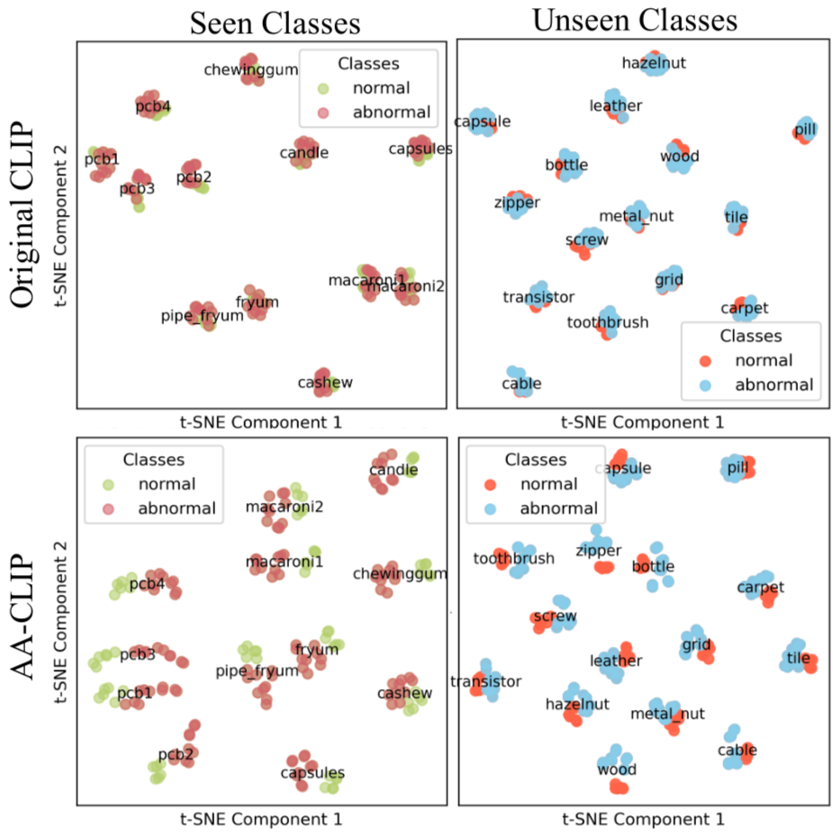
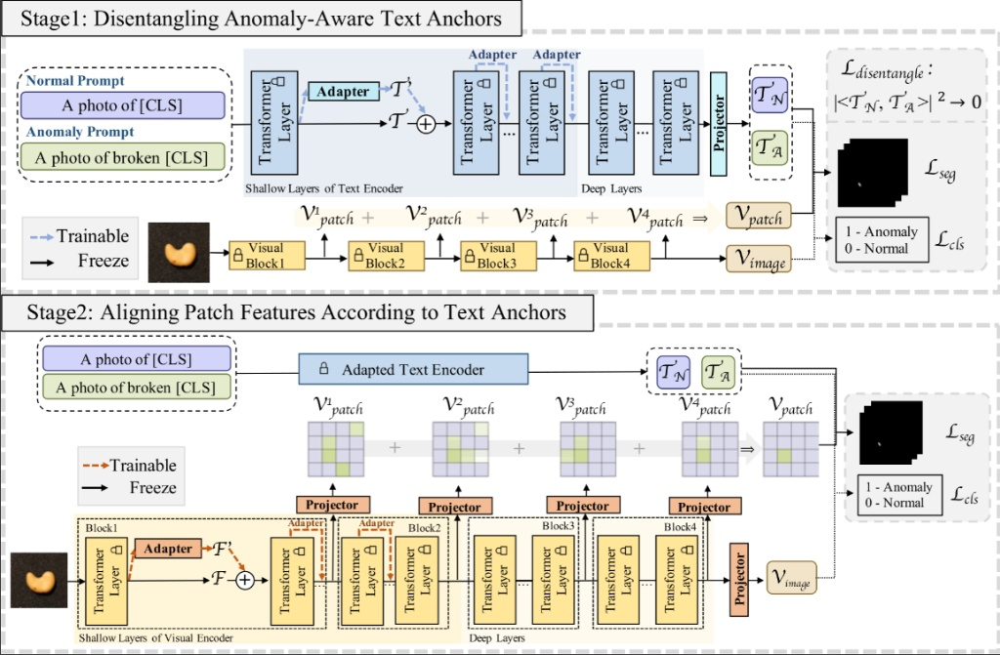

# AA-CLIP: Anomaly-Aware CLIP으로 Zero-Shot 이상 탐지 강화

## Paper Metadata

| Item | Content |
|---|---|
| Title | AA-CLIP: Enhancing Zero-Shot Anomaly Detection via Anomaly-Aware CLIP |
| Authors | Wenxin Ma, Xu Zhang, Qingsong Yao, Fenghe Tang, Chenxu Wu, Yingtai Li, Rui Yan, Zihang Jiang, S. Kevin Zhou |
| Conference / Journal | CVPR 2025 |
| Year | 2025 |
| Paper link | https://openaccess.thecvf.com/content/CVPR2025/papers/Ma_AA-CLIP_Enhancing_Zero-Shot_Anomaly_Detection_via_Anomaly-Aware_CLIP_CVPR_2025_paper.pdf |
| GitHub / Official code | https://github.com/Mwxinnn/AA-CLIP |
| Reason for investigation | CLIP 기반 방법이 source anomaly data로 학습한 정보를 보지 못한 target 범주에 전이하는 방식을 이해하고, one-class 재구성 방법과 학습 정보 범위를 구분하기 위함. |

## 한 문장 요약

AA-CLIP은 원래 CLIP이 잘 구분하지 못하는 **정상/이상 의미**를 먼저 text space에서 분리하고, 그 결과를 anchor로 사용해 patch-level visual feature를 정렬하는 2단계 residual-adapter 방법이다 [1].

## 문제: 원래 CLIP만으로는 왜 부족한가



CLIP은 이미지와 문장의 전역 의미를 잘 맞추지만, 산업 결함처럼 작고 미세한 이상을 위해 학습된 모델은 아니다. 논문은 다음 두 문제를 출발점으로 든다 [1].

1. **Anomaly-unawareness**: 결함이 보이는 이미지도 정상 prompt와 더 유사하게 표현될 수 있다. 따라서 “normal”과 “anomalous” text embedding 사이의 경계가 충분히 선명하지 않다.
2. **Fine-grained localization 부족**: 전역 image-text alignment만으로는 어느 patch가 이상인지 정확히 찾기 어렵다.

단순히 전체 CLIP을 fine-tuning하면 pretrained class knowledge가 훼손되어, 학습에 없던 범주로의 generalization이 약해질 수 있다. AA-CLIP은 이 trade-off를 줄이기 위해 backbone 전체가 아니라 얕은 층의 작은 residual adapter만 적응시킨다.

## 핵심 아이디어: text를 먼저, visual을 나중에




```text
Stage 1: 정상/이상 text anchor를 분리
          ↓
Stage 2: image patch feature를 분리된 anchor에 정렬
          ↓
normal-anchor와 anomaly-anchor의 유사도 차이로 image score와 anomaly map 생성
```

### 공통 구성: Residual Adapter

text encoder와 visual encoder의 앞쪽 `K`개 transformer layer에 adapter를 넣는다. 각 layer의 원 feature `x_i`에서 adapter residual을 만들고, 원 feature와 가중합해 다음 layer로 전달한다 [1].

```text
x_i^enhanced = λ · adapter(x_i) + (1 - λ) · x_i
```

- `λ`: 새 anomaly-specific 정보와 기존 CLIP 지식을 섞는 비율.
- 목적: CLIP의 범주 일반화 능력을 최대한 보존하면서 이상 탐지에 필요한 부분만 바꾸는 것.

### Stage 1 - Anomaly-aware text anchor 만들기

- **학습 대상**: text encoder의 얕은 residual adapter와 final text projector.
- **고정 대상**: visual encoder.
- normal prompt와 anomaly prompt를 text encoder에 넣어 각 범주의 normal anchor `T_N`, anomaly anchor `T_A`를 얻는다.
- source image의 image-level label과 pixel mask를 사용해 classification loss와 segmentation loss로 anchor가 visual feature와 맞도록 학습한다.
- 추가로 **Disentangle Loss**를 넣어 두 anchor가 서로 직교에 가깝도록 만든다.

```text
L_dis = |<T_N, T_A>|²
L_total = L_align + γ · L_dis
```

핵심은 `T_N`과 `T_A`가 비슷한 방향을 보지 않게 만들어, “정상”과 “이상”이라는 텍스트 의미 자체를 더 분명한 판별 기준으로 만드는 것이다.

### Stage 2 - patch feature를 text anchor에 맞추기

- **학습 대상**: visual encoder의 얕은 residual adapter.
- **고정 대상**: Stage 1에서 학습한 text anchor.
- 여러 visual layer의 intermediate patch feature를 사용한다.
- 각 patch가 normal/anomaly text anchor 중 어디와 가까운지로 segmentation supervision을 주어, 이상 위치가 anomaly anchor 쪽으로 가도록 정렬한다.

추론 시에는 patch별 normal/anomaly anchor 유사도로 anomaly map을 만들고, 이를 모아 image-level anomaly score를 얻는다. 즉 text anchor가 “무엇이 정상/이상인가”의 기준을 제공하고, visual patch가 “어디가 이상인가”를 제공한다.

## Zero-shot 설정을 읽는 법

AA-CLIP의 zero-shot은 **target dataset에서 anomaly label로 학습하지 않는다**는 뜻이다. source dataset에는 image-level anomaly label과 pixel mask를 사용하는 supervision이 있다 [1].

예를 들어 VisA에서 adapter와 text anchor를 학습한 뒤 MVTec AD를 평가하면:

| 구분 | 역할 |
|---|---|
| VisA | source: anomaly-aware representation 학습에 쓰는 label/mask 보유 데이터 |
| MVTec AD | target: adapter 학습에는 쓰지 않고, 보지 못한 범주 generalization을 측정하는 데이터 |

따라서 이는 “MVTec의 정상 train 이미지만 사용한 one-class 방법”과 학습 정보가 다른 protocol이다. 두 결과를 비교할 때는 AUROC만이 아니라 source supervision 사용 여부와 target data 사용 범위를 함께 적어야 한다.

## 논문이 주장하는 기여

1. CLIP의 anomaly-unawareness를 text와 visual space 모두에서 순차적으로 적응시키는 AA-CLIP을 제안한다.
2. residual adapter로 pretrained CLIP 지식을 크게 훼손하지 않고 anomaly-specific 정보를 넣는다.
3. text anchor disentanglement와 patch alignment를 결합해 image-level 분류와 pixel-level localization을 함께 개선한다.

## 강점과 해석상 주의점

| 항목 | 내용 |
|---|---|
| 강점 | 전체 CLIP을 새로 학습하지 않고 작은 adapter 중심으로 적응한다. |
| 강점 | text semantic boundary와 patch localization을 분리해 학습하므로, “무엇이 이상인가”와 “어디가 이상인가”를 연결한다. |
| 강점 | source에서 배운 anomaly awareness가 unseen target class에도 전이되는지를 평가한다. |
| 주의점 | target zero-shot이라도 source anomaly annotation을 사용한다. 완전한 무학습(learning-free) 방법은 아니다. |
| 주의점 | 성능은 source/target dataset 조합, prompt, adapter layer 수, 학습 shot 수에 영향을 받는다. |
| 주의점 | 논문 수치와 재현 수치를 비교할 때는 source split, backbone checkpoint, precision, runtime을 동일 protocol으로 기록해야 한다. |

## 현재 연구와의 연결

AA-CLIP은 normal-only reconstruction 기반의 RD4AD와 달리 source anomaly supervision을 사용한다. 따라서 이 방법은 RD4AD의 직접 대체 baseline이라기보다, **source supervision이 허용될 때 cross-dataset zero-shot anomaly detection이 어디까지 가능한지**를 보여 주는 비교 기준으로 해석하는 것이 적절하다.

## 참고문헌

[1] Ma, Wenxin, et al. "AA-CLIP: Enhancing Zero-Shot Anomaly Detection via Anomaly-Aware CLIP." *Proceedings of the IEEE/CVF Conference on Computer Vision and Pattern Recognition*, 2025, pp. 4744-4754.
