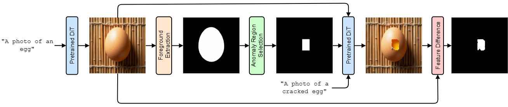
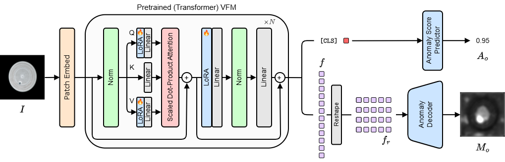

# AnomalyVFM: Vision Foundation Model을 Zero-Shot 이상 탐지기로 바꾸는 방법

## Paper Metadata

| Item | Content |
|---|---|
| Title | AnomalyVFM -- Transforming Vision Foundation Models into Zero-Shot Anomaly Detectors |
| Authors | Matic Fučka, Vitjan Zavrtanik, Danijel Skočaj |
| Conference / Journal | CVPR 2026 |
| Year | 2026 |
| Paper link | https://openaccess.thecvf.com/content/CVPR2026/papers/Fucka_AnomalyVFM_--_Transforming_Vision_Foundation_Models_into_Zero-Shot_Anomaly_Detectors_CVPR_2026_paper.pdf |
| GitHub / Official code | https://github.com/MaticFuc/AnomalyVFM |
| Reason for investigation | CLIP prompt를 쓰지 않는 pure vision foundation model(VFM)이 synthetic auxiliary supervision만으로 target-free zero-shot anomaly detection을 수행하는 방식을 비교하기 위함. |

## 한 문장 요약

AnomalyVFM은 FLUX 기반으로 만든 대규모 synthetic normal/anomaly dataset으로 pretrained VFM 내부를 LoRA feature adapter로 적응시켜, **in-domain image 없이** image-level anomaly score와 pixel-level anomaly map을 예측하는 방법이다 [1].

## 문제: VFM은 있는데 왜 zero-shot anomaly detection이 약한가

DINOv2, RADIO 같은 VFM은 범용 visual representation을 제공하지만, anomaly detection을 위해 바로 쓰면 CLIP 계열 zero-shot 방법보다 성능이 낮았다고 논문은 지적한다 [1]. 논문이 제시하는 원인은 두 가지다.

1. **기존 auxiliary anomaly dataset의 다양성 부족**: 적은 객체·배경·결함 조합으로는 보지 못한 target object의 이상을 일반화하기 어렵다.
2. **얕은 adaptation**: VFM output head만 학습하면 transformer 내부 representation은 거의 바뀌지 않는다. 정상과 이상을 구분하는 feature를 backbone 내부에서 충분히 형성하기 어렵다.

목표는 target domain의 정상/이상 image나 annotation을 쓰지 않으면서도, VFM이 일반적인 local defect를 찾는 표현을 갖게 하는 것이다.

## 핵심 아이디어

```text
텍스트 prompt로 다양한 정상 object image 생성
                    ↓
샘플링한 영역을 inpainting하여 local synthetic defect 생성
                    ↓
feature-level verification으로 실패하거나 불명확한 합성 sample 제거
                    ↓
synthetic image + mask로 pretrained VFM의 LoRA feature adapter 학습
                    ↓
target image 1장 입력 → anomaly score + pixel anomaly map
```

### 1. 3단계 synthetic anomaly dataset 생성

AnomalyVFM은 실제 target dataset 대신 생성 모델(논문에서는 FLUX)을 이용해 auxiliary training set을 만든다 [1].



| 단계 | 하는 일 | 목적 |
|---|---|---|
| 1. normal image generation | 다양한 object/background 조합의 anomaly-free image 생성 | 학습 object의 범위를 넓힘 |
| 2. local anomaly synthesis | 선택한 위치를 inpainting해 국소 defect가 있는 image 생성 | image-level label과 pixel supervision 후보 생성 |
| 3. feature-based verification | normal/anomaly image의 feature 차이를 확인해 defect 생성 실패·무관한 sample을 제거하고 mask를 보정 | synthetic label noise를 줄임 |

핵심은 단순 copy-paste나 제한된 공개 anomaly dataset이 아니라, 많은 object·texture·defect 조합을 가진 synthetic supervision을 만드는 데 있다.

### 2. LoRA feature adaptation

생성된 synthetic data로 pretrained VFM의 transformer attention 내부에 low-rank feature adapter를 넣어 학습한다 [1].



- backbone 전체를 full fine-tuning하지 않고 작은 수의 adapter parameter만 업데이트한다.
- adapter는 VFM 내부 feature가 normal appearance와 local anomaly를 더 잘 구분하도록 바꾼다.
- lightweight convolutional decoder가 adapted feature를 pixel anomaly map으로 변환한다.

이 설계는 output head만 추가하는 adaptation보다 내부 visual representation 자체를 anomaly detection에 맞추되, 전체 backbone을 다시 학습하는 비용은 줄이려는 선택이다.

### 3. Confidence-weighted pixel loss

synthetic anomaly mask는 완벽하지 않을 수 있다. 예를 들어 inpainting이 의도한 결함을 충분히 만들지 못하거나, 생성된 변화가 mask 경계와 정확히 맞지 않을 수 있다. AnomalyVFM은 pixel별 confidence를 사용해 모호한 synthetic supervision의 손실 비중을 낮춘다 [1].

따라서 decoder는 모든 synthetic mask pixel을 같은 신뢰도로 맞추기보다, feature 변화가 뚜렷한 pixel을 더 신뢰하며 학습한다.

## Zero-shot을 읽는 법

AnomalyVFM의 zero-shot은 **target dataset의 in-domain training image와 annotation을 사용하지 않는다**는 뜻이다. 그러나 parameter update가 전혀 없다는 뜻은 아니다.

| 항목 | AnomalyVFM |
|---|---|
| target 정상 image | 학습에 사용 안 함 |
| target anomaly image / mask | 학습에 사용 안 함 |
| auxiliary training data | 생성 모델로 만든 synthetic normal/anomaly image와 mask 사용 |
| target-specific fine-tuning | 없음 |
| inference input | target image 한 장 |

즉 AnomalyVFM은 **learning-free zero-shot**이 아니라, target-free synthetic auxiliary training을 거친 zero-shot detector다.

## 논문이 주장하는 결과

논문은 RADIO backbone을 사용했을 때 9개 산업 anomaly detection dataset 평균 image-level AUROC 94.1%를 보고하며, 기존 best zero-shot 방법보다 3.3%p 높다고 주장한다 [1]. 또한 VFM backbone을 바꿔도 적용 가능한 framework임을 보인다.

## 강점과 해석상 주의점

| 항목 | 내용 |
|---|---|
| 강점 | target dataset에 의존하지 않고 다양한 synthetic supervision으로 VFM을 적응시킨다. |
| 강점 | VFM backbone 내부를 parameter-efficient하게 바꾸므로 output head만 학습하는 방법보다 표현 적응 범위가 넓다. |
| 강점 | text prompt 없이 image 하나만으로 anomaly score와 mask를 출력한다. |
| 주의점 | 생성 모델·inpainting·feature verification 품질이 synthetic training signal을 좌우한다. |
| 주의점 | synthetic defect와 실제 산업 결함 사이의 domain gap은 남는다. |
| 주의점 | target-free이지만 synthetic data 생성과 adapter 학습이 필요하므로 learning-free 방법보다 준비·계산 비용이 크다. |
| 주의점 | 논문 이후 공식 repository의 안정화 설정은 논문과 일부 hyperparameter가 다를 수 있다고 명시하므로, 재현 시 paper setting과 current-code setting을 분리해야 한다. |
## 참고문헌

[1] Fučka, Matic, Vitjan Zavrtanik, and Danijel Skočaj. "AnomalyVFM -- Transforming Vision Foundation Models into Zero-Shot Anomaly Detectors." *Proceedings of the IEEE/CVF Conference on Computer Vision and Pattern Recognition*, 2026, pp. 35555-35566.
