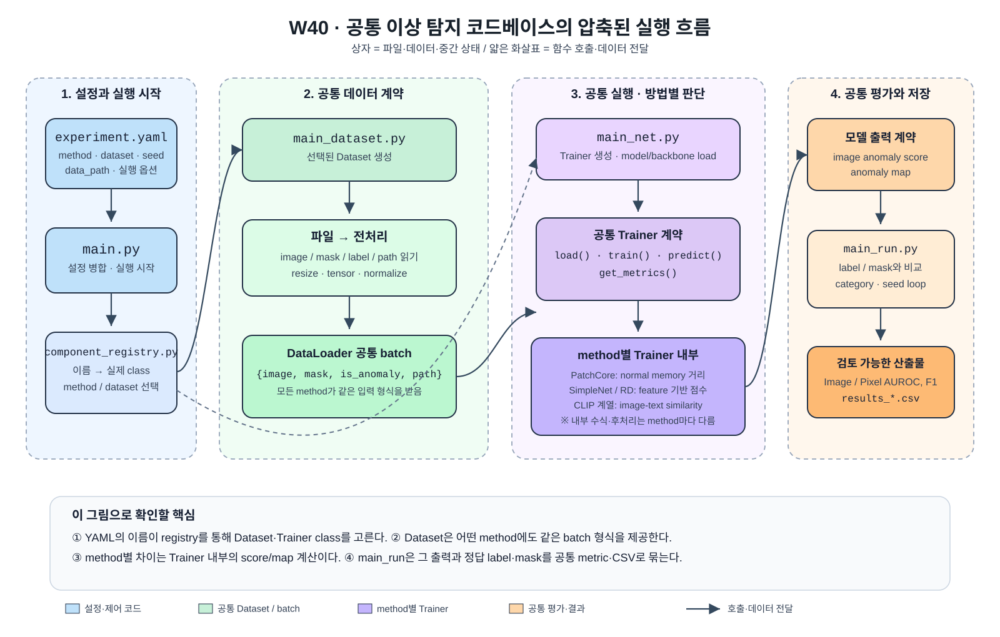

# W40 공통 프레임워크 발표 자료 - 한 이미지 입출력으로 확인한 구조

## 1. 발표의 목표

> 공통 프레임워크는 데이터를 어떤 공통 형식으로 처리하고, `method` 값에 따라 어떻게 다른 모델을 고르며, 각 모델의 결과를 어떻게 공통 metric으로 연결하는가?

이번 발표의 주제는 AnomalyCLIP 논문이나 한 이미지의 성능이 아니라, 여러 이상 탐지 방법을 하나의 실행 흐름에서 다루기 위해 만든 **공통 프레임워크의 구조**다. AnomalyCLIP의 MVTec AD `bottle/test/broken_large/000.png` 한 장은 `Dataset → DataLoader → Registry → Trainer → score/map` 연결이 실제로 동작한다는 실행 근거로만 사용한다.

**중요:** 공통 프레임워크가 모든 방법의 내부 수식을 같게 만든 것은 아니다. 공통인 부분은 설정 병합, Dataset/DataLoader, trainer 선택, 실행 순서, 결과 반환 계약이다. PatchCore·SimpleNet·AnomalyCLIP은 patch score를 만드는 식과 map 후처리 세부가 서로 다르다.

## 2. 공통 프레임워크 전체 구조



그림에서 상자는 파일·데이터·중간 상태이며, 얇은 화살표는 함수 호출 또는 데이터 전달이다. 공통 프레임워크는 `Trainer`를 고르는 과정과 입력·평가 형식을 공유하고, 실제 점수와 map을 계산하는 방식은 `Trainer` 내부에서 method별로 달라진다.

```text
experiment YAML
  ↓ 설정 병합
main.py
  ├─ component_registry.py : method/dataset 이름을 실제 class로 연결
  ├─ main_dataset.py       : Dataset을 공통 batch dict로 변환
  ├─ main_net.py           : 선택된 Trainer 생성·load
  └─ main_run.py           : 공통 lifecycle 실행·metric/CSV 저장
                              ↓
               method별 Trainer.predict()
               ├─ AnomalyCLIP: text similarity
               ├─ PatchCore: normal memory와의 거리
               └─ SimpleNet: discriminator score
                              ↓
                image score + anomaly map + metric
```

발표의 핵심은 위 화살표 중 어디까지가 공통이고, 마지막 `Trainer.predict()` 안에서 무엇이 방법별로 달라지는지 구분하는 것이다.

## 3. 한 이미지 실행 근거

| 항목 | 실제 값 | 의미 |
|---|---:|---|
| 대상 파일 | `bottle/test/broken_large/000.png` | MVTec AD의 broken-large 결함 이미지 1장 |
| 이미지 정답 label | `1` | 정상=0, 이상=1 |
| Dataset batch image | `[1, 3, 518, 518]` | 한 장의 RGB 이미지가 ImageNet 정규화된 tensor |
| CLIP 모델 입력 | `[1, 3, 518, 518]` | 같은 RGB를 CLIP 정규화 상수로 다시 변환한 tensor |
| 텍스트 feature | `[2, 768]` | 정상/이상 텍스트 기준 벡터 2개 |
| global image feature | `[1, 768]` | 이미지 전체를 대표하는 CLIP feature |
| patch feature | `[1, 1370, 768]` | 위치별 feature 1,370개 |
| 정상 텍스트 유사도 logit | `-0.127773` | 정상 기준과의 비교값 |
| 이상 텍스트 유사도 logit | `0.205786` | 이상 기준과의 비교값 |
| 최종 image anomaly score | `0.991550` | softmax 뒤 이상 class 점수. 확률로 단정하지 않고 같은 설정 안에서 상대 비교에 사용 |
| 최종 anomaly map 범위 | `0.000272–0.969498` | 518×518 위치별 이상 점수 |
| 표준 경로와 펼친 계산의 score 차이 | `0.0` | 시연용 중간 상태 계산이 실제 `Trainer.predict()` 결과와 일치 |

시각 자료: [한 이미지 전체 입출력 panel](../method6/source/results/w40_common_framework_single_image/single_image_io_panel.png). 이 panel은 프레임워크 구조가 실제 tensor와 결과 파일까지 연결되었음을 보여 주는 evidence다.


이 사례에서 map의 가장 강한 반응은 깨진 유리 영역 근처에 나타난다. 다만 병의 다른 테두리에도 반응이 있으므로, 이 한 장만으로 “모든 정상 영역에서 오탐이 없다”는 주장은 할 수 없다.

## 4. 공통 데이터 처리: Dataset에서 batch까지

### 4.1 한 이미지로 확인한 공통 데이터 흐름

```text
원본 PNG
  ↓ Dataset.__getitem__
{image, mask, is_anomaly, image_path, image_name}
  ↓ DataLoader (batch size=1)
image: [1,3,518,518], mask: [1,1,518,518]
  ↓ AnomalyCLIP adapter: ImageNet 정규화 → CLIP 정규화
CLIP input: [1,3,518,518]
  ↓ ViT-L/14 image encoder + 학습된 normal/abnormal text prompt
global feature: [1,768], patch features: [1,1370,768]
  ↓ global image-text similarity
image anomaly score: 0.991550
  ↓ patch-text similarity → layer map 합산 → bilinear resize → Gaussian smoothing
anomaly map: [1,518,518]
```

`mask`는 **모델 입력이 아니다.** 테스트 결과를 평가하거나 모델이 찾은 위치와 실제 결함 위치를 비교하기 위한 정답이다. 모델은 `image`와 학습된 prompt만으로 score/map을 만든다.

### 4.2 설정값에서 Dataset까지

| 순서 | 핵심 파일·함수 | 직접 설명할 내용 |
|---|---|---|
| 1 | 외부 공유 framework `main.py::resolve_args()` | 공통 기본값 → method YAML → experiment YAML → CLI 순서로 설정을 합침. 이번에는 `method: anomalyclip`, `dataset: mvtec`, `category: bottle`이 들어감. |
| 2 | `component_registry.py::get_dataset_spec()` | `mvtec + anomalyclip` 조합을 일반 MVTec Dataset이 아닌 `datasets.anomalyclip_mvtec.MVTecDataset`으로 바꿈. 따라서 공식 AnomalyCLIP의 Resize → CenterCrop 공간 전처리를 사용함. |
| 3 | `datasets/base.py::__getitem__()` | 파일을 열어 sample dict를 만듦. `image`는 RGB tensor, `mask`는 0/1 정답 위치, `is_anomaly`는 사진 단위 정답 label임. |
| 4 | `main_dataset.py::_make_loader()` | Dataset의 sample dict를 batch dict로 묶음. 테스트는 순서를 유지하고 한 장씩 처리함. |

### 4.3 한 이미지로 확인한 전처리 결과

1. 원본 PNG를 RGB로 읽음.
2. shortest edge를 518로 맞춘 뒤 518×518 center crop을 적용함.
3. `ToTensor()`로 픽셀 범위를 0–1 실수로 바꿈.
4. Dataset 단계에서 ImageNet 평균·표준편차로 정규화함.
5. AnomalyCLIP adapter의 `_to_clip_normalized()`가 값을 한 번 역정규화한 후 OpenAI CLIP 평균·표준편차로 다시 정규화함.

두 번째 panel이 원본과 거의 똑같이 보이는 이유는 **CLIP 입력을 역정규화하여 사람이 볼 수 있게 표시했기 때문**이다. 실제 모델에 들어가는 tensor 숫자 범위는 원본 RGB와 다르다.

## 5. 공통 모델 교체 구조

### 5.1 `method` 한 줄이 Trainer를 고르는 과정

```text
experiment_anomalyclip.yaml: method: anomalyclip
  ↓
component_registry.py: METHOD_REGISTRY['anomalyclip']
  ↓
trainer.trainer_anomalyclip.Trainer_AnomalyCLIP
  ↓
main_net.py: trainer.load(...)
```

공통 runner는 개별 논문의 내부를 직접 알 필요가 없다. registry가 선택한 trainer가 아래 공통 약속을 지키면 된다. 이 interface가 모델 교체의 핵심이다.

| 공통 함수 | 역할 |
|---|---|
| `load()` | 선택한 모델과 checkpoint를 준비 |
| `train()` | 학습 또는 checkpoint 기반 평가를 실행 |
| `predict()` | test batch를 image score와 anomaly map으로 변환 |
| `get_evaluation_metrics()` | AUROC 등 metric dict를 반환 |
| `set_model_dir()` | 결과·model 저장 위치를 받음 |

| `method` 예시 | registry가 선택하는 내부 방식 | 공통 runner가 보는 결과 |
|---|---|---|
| `anomalyclip` | 학습된 prompt와 image/patch-text similarity | image score, anomaly map, metric |
| `patchcore` | normal memory bank와 최근접 거리 | image score, anomaly map, metric |
| `simple` | feature projection과 discriminator score | image score, anomaly map, metric |

이번 AnomalyCLIP은 target MVTec의 정상 이미지만으로 prompt를 다시 학습하지 않는다. 이미 학습된 ViSA→MVTec prompt checkpoint를 `load()`에서 읽고, `train()`은 공통 lifecycle과 호환되도록 test evaluation을 호출한다. 이 점은 SimpleNet처럼 이 framework 안에서 target normal set으로 학습하는 방법과 다르다.

## 6. 공통 출력 계약과 방법별 후처리

`trainer/trainer_anomalyclip.py::predict()`의 순서는 아래와 같다.

1. `image = _to_clip_normalized(raw_image)`
2. `encode_image()`로 global image feature와 위치별 patch feature를 얻음.
3. `_text_features()`로 정상/이상 텍스트 feature 두 개를 얻음.
4. global image feature와 두 text feature의 내적으로 image logits를 계산함.
5. `softmax(logits / 0.07)[:, 1]`에서 이상 class의 값을 final image anomaly score로 선택함.
6. 각 patch feature와 두 text feature를 비교해 patch별 normal/abnormal similarity를 얻음.
7. `abnormal similarity + (1 - normal similarity)`를 2로 나누어 위치별 이상값을 만듦.
8. 선택 layer의 map을 합산하고, mask 크기(518×518)로 bilinear interpolation함.
9. Gaussian smoothing(`sigma=4.0`)을 적용한 결과가 final anomaly map임.

즉, **global feature는 사진 전체가 이상인지 판단하는 image score에**, **patch feature는 이상 위치를 표시하는 anomaly map에** 쓰인다. 이는 AnomalyCLIP의 내부 방식이며, 프레임워크는 이 결과를 다른 방법과 같은 `image score + anomaly map` 형태로 받아 metric 계산으로 넘긴다.

## 7. 코드와 실행 근거 위치

| 용도 | 경로 |
|---|---|
| 한 이미지 입출력 캡처 스크립트 | `method6/source/capture_anomalyclip_framework_single_image.py` |
| 실제 실행 설정 | `C:\Users\test\Downloads\dinomaly_share_codebase\dinomaly_share_codebase\experiment_anomalyclip.yaml` |
| 공유 framework 입구 | `C:\Users\test\Downloads\dinomaly_share_codebase\dinomaly_share_codebase\main.py` |
| 모델 선택 registry | `C:\Users\test\Downloads\dinomaly_share_codebase\dinomaly_share_codebase\component_registry.py` |
| DataLoader 생성 | `C:\Users\test\Downloads\dinomaly_share_codebase\dinomaly_share_codebase\main_dataset.py` |
| AnomalyCLIP adapter | `C:\Users\test\Downloads\dinomaly_share_codebase\dinomaly_share_codebase\trainer\trainer_anomalyclip.py` |
| 실행 결과 기록 | `method6/source/results/w40_common_framework_single_image/single_image_io_record.json` |
| 원본·입력·mask·map·overlay | `method6/source/results/w40_common_framework_single_image/01_*.png`–`05_*.png` |
| 통합 시각화 | `method6/source/results/w40_common_framework_single_image/single_image_io_panel.png` |
| 전체 bottle 83장 실행 결과 | `related_work/markdown/W40_AnomalyCLIP_bottle_실행_검증.md` |

공유 framework와 dataset/checkpoint는 용량·관리 규칙상 이 repository에 복사하지 않는다. 발표 자료에는 실행 코드, 설정 위치, 결과 JSON과 PNG만 남긴다.

## 8. 발표에서 답할 수 있어야 할 확인 질문

1. **정답 mask를 모델이 보고 판단했는가?** 아니요. mask는 최종 map의 위치 평가용 정답이다.
2. **전처리 후 이미지가 원본과 같은데 무엇이 달라졌는가?** 사람이 보는 panel은 역정규화했기 때문에 같아 보인다. 모델이 받는 tensor의 정규화 기준은 ImageNet에서 CLIP 기준으로 바뀐다.
3. **image score와 anomaly map은 같은 값인가?** 아니다. image score는 global image feature와 text feature로 만든 한 숫자이고, anomaly map은 patch별 비교를 공간적으로 복원한 518×518 지도다.
4. **모델을 SimpleNet으로 바꾸면 무엇이 유지되는가?** 설정 → registry → Dataset/DataLoader → runner → metric 반환이라는 외부 흐름은 유지된다. 다만 선택된 Trainer와 patch score 계산식은 SimpleNet 것으로 바뀐다.
5. **score 0.991550은 이상일 확률인가?** 아니다. 현재 prompt·temperature·전처리 조건에서 이상 text 쪽으로 얼마나 기울었는지를 나타내는 상대 점수다. 고정 threshold를 주장하려면 별도의 validation/calibration 절차가 필요하다.

## 9. 발표 범위

- 이 발표는 공통 프레임워크의 **데이터 처리·모델 교체·출력 연결 구조**를 설명한다.
- `bottle` 결함 이미지 한 장은 그 구조가 실제로 tensor·score·map 파일까지 이어지는지 보여 주는 실행 evidence다. 전체 MVTec AD 성능 또는 논문 재현 완료를 뜻하지 않는다.
- 확인된 전체 `bottle` test split 결과는 Image AUROC `0.8881`, Pixel AUROC `0.9038`이며, 세부는 [W40 bottle 실행 검증](../related_work/markdown/W40_AnomalyCLIP_bottle_실행_검증.md)에 있다.
- 다른 방법도 같은 framework lifecycle을 쓰지만, 실제 `predict()`와 score/map 수식은 각 trainer에서 따로 확인해야 한다.
